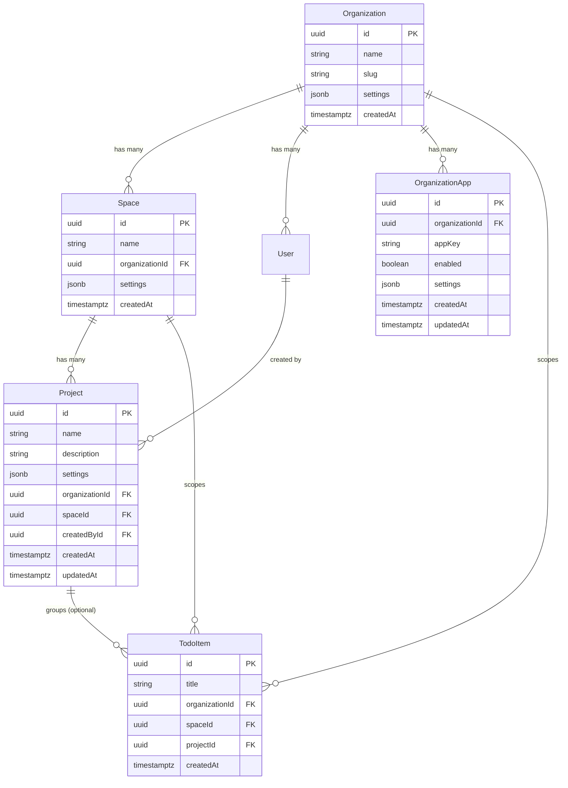

## Enhancement Summary

**Deepened on:** 2026-03-07
**Sections enhanced:** 8
**Research sources:** TypeORM docs (Context7), NestJS docs (Context7), Angular v20 docs (Context7), Web search (TypeORM multi-schema, NestJS monorepo patterns), 11 specialized review agents (TypeScript, Architecture, Security, Performance, Data Integrity, Pattern Recognition, Code Simplicity, Agent-Native, Data Migration, Schema Drift, Best Practices)

### Key Improvements
1. **Critical: TypeORM cross-schema FK migration bug** -- Foreign key constraints pointing to different schemas get re-created every migration run (TypeORM #8565). Mitigation strategy added.
2. **Schema bootstrap ordering** -- Must use `onApplicationBootstrap` (not `OnModuleInit`) to ensure schema creation happens before TypeORM synchronize.
3. **Angular functional guards** -- Use modern `CanActivateFn` pattern instead of class-based guards for route protection.
4. **HasAppAccessGuard caching** -- Cache `organization_apps` lookups to avoid per-request DB queries.
5. **Cross-schema constraint naming** -- PostgreSQL shares constraint names across schemas; must use schema-prefixed constraint names.
6. **PlatformModule as `@Global()`** -- Use NestJS `@Global()` decorator to avoid importing PlatformModule in every mini app module.

### New Considerations Discovered
- TypeORM `synchronize: false` can be set per-entity to prevent unwanted DDL on specific tables
- Angular `canActivateChild` can protect all `/apps/*` child routes with a single guard declaration
- ESLint `no-restricted-imports` pattern needs refinement -- will match same-app imports too (use `eslint-plugin-boundaries` or relative path exclusion)
- Schema bootstrap should also handle `search_path` configuration for TypeORM query builder

# feat: Multi-App Platform Architecture

## Overview

Transform the VML Open Boilerplate monorepo into a multi-developer, multi-app umbrella platform. Multiple developers independently build full-stack "mini apps" (NestJS API modules + Angular lazy-loaded routes) that share auth, organization, user, space, and project infrastructure plus services like AI, notifications, and storage -- without stepping on each other's code or data.

The architecture uses a **convention-based monorepo** with `mini-apps/` directories, **PostgreSQL schemas** for per-app database isolation, a **manifest file** (`mini-apps.json`) for app registry, **per-org app enablement**, and an **interactive CLI** for scaffolding (see brainstorm: `docs/brainstorms/2026-03-07-multi-app-platform-brainstorm.md`).

## Problem Statement

The current boilerplate is a single-app monorepo. To support multiple development teams building independent features on shared infrastructure, we need:

1. **Isolation** -- each app's code, data, and routes are separated so developers don't collide
2. **Shared foundation** -- auth, multi-tenancy (org/space/project), AI services, and UI shell are reused, not duplicated
3. **Scaffolding** -- a CLI that generates correct, working, tested code following all conventions
4. **AI-safety** -- agent guardrails (AGENTS.md + lint rules) that prevent cross-app contamination
5. **Testing** -- shared test harness + per-app test isolation to prevent regressions

## Proposed Solution

### Architecture Summary

```
apps/
  api/src/
    mini-apps/                    # All mini app backends
      <app-name>/
        <app-name>.module.ts      # Self-contained NestJS module
        <app-name>.controller.ts
        <app-name>.service.ts
        entities/                 # App-scoped entities (PG schema: <app-name>)
        dto/
        AGENTS.md
    _core/                        # Existing: guards, utils, third-party
    _platform/                    # NEW: shared services extracted for app consumption
      platform.module.ts
      testing/                    # Shared test utilities
    organization/                 # Existing shared modules
    space/
    user/
    project/                      # NEW: shared Project entity
  web/src/app/
    mini-apps/                    # All mini app frontends
      <app-name>/
        <app-name>.routes.ts
        pages/
        components/
        services/
        AGENTS.md
    pages/
      dashboard/                  # NEW: tool grid landing page
      project/                    # NEW: project page with app grid
```

### Key Design Decisions (from brainstorm)

| Decision | Choice | Rationale |
|----------|--------|-----------|
| App scope | Full-stack (API + Web) | Maximum flexibility per app |
| Frontend | Lazy-loaded routes in single Angular app | Single build, shared shell, simple deployment |
| Backend | NestJS modules in shared API | Shared DB connection, auth guards, DRY |
| DB isolation | PostgreSQL schemas | Stronger than naming conventions, lighter than separate DBs |
| Tenant scoping | Org + Space required, Project optional | Matches existing hierarchy |
| Navigation | Dashboard grid + project grid | Apps are tools, not sidebar items |
| App registry | `mini-apps.json` manifest | Single source of truth for registration |
| App permissions | Per-org enablement | Org admins control which apps are available |
| Shared UI | PrimeNG directly, no app-specific library | Avoid premature abstraction |
| App removal | Soft disable only | Safe; hard delete is manual |

## Technical Approach

### Architecture

#### NestJS Module Registration

Each mini app is a self-contained `@Module` imported via a `MiniAppsModule` aggregator:

```
AppModule
  -> CommonModule (existing shared services)
  -> MiniAppsModule (NEW aggregator)
       -> TodoModule
       -> InvoicesModule
       -> ...
```

- `MiniAppsModule` is imported by `AppModule` and dynamically imports all mini app modules
- Each mini app module calls `TypeOrmModule.forFeature([...its entities...])` for repository injection
- Each mini app module imports `PlatformModule` to get shared services (org context, auth context, AI, etc.)
- CLI markers (`// MINIAPP_MODULES_IMPORT`, `// MINIAPP_MODULES_REF`) in `mini-apps.module.ts` for the CLI to insert new modules

**Why not add to existing `AppModule`/`CommonModule`?** The existing marker pattern (`// CLI_CONTROLLERS_IMPORT` etc.) puts controllers in `AppModule` and services in `CommonModule`. Mini apps are self-contained modules with their own controllers AND services, so they need a separate aggregation point. This also keeps mini app imports cleanly separated from core infrastructure.

##### Research Insights: NestJS Module Patterns

**Best Practices (from NestJS docs):**
- Use `@Global()` decorator on `PlatformModule` so mini apps don't need to explicitly import it in every module. This matches the NestJS pattern for cross-cutting concerns:
  ```typescript
  @Global()
  @Module({
    imports: [CommonModule],
    providers: [/* platform services */],
    exports: [/* platform services */],
  })
  export class PlatformModule {}
  ```
- Consider using `DynamicModule` with `forRoot()` on PlatformModule if configuration needs to vary (e.g., which services to expose). For now, static `@Module` is simpler and sufficient.
- NestJS docs recommend that each module should solve one problem. `MiniAppsModule` as an aggregator aligns with this -- it's a composition module, not a feature module.

**Edge Cases:**
- Circular dependency risk: if `PlatformModule` imports `CommonModule` which imports `PlatformModule`. Solution: `PlatformModule` should import services directly via `forwardRef()` or inject via tokens, not import `CommonModule` as a whole.
- Module resolution order matters for the schema bootstrap. `DatabaseModule` must be imported before `MiniAppsModule` in `AppModule` imports array.

**References:**
- [NestJS Dynamic Modules](https://docs.nestjs.com/fundamentals/dynamic-modules)
- [NestJS Module Reference](https://docs.nestjs.com/modules)

#### Angular Route Registration

Consolidate to `app.routes.ts` (standalone) as the single routing file. Add a `mini-apps` parent route with CLI markers:

```typescript
// app.routes.ts
{
  path: 'apps',
  children: [
    // MINIAPP_ROUTES_IMPORT
    // MINIAPP_ROUTES_REF
  ]
}
```

Each mini app registers as:
```typescript
{
  path: '<app-name>',
  loadChildren: () => import('./mini-apps/<app-name>/<app-name>.routes')
    .then(m => m.routes)
}
```

All mini app routes are namespaced under `/apps/<name>/`, preventing collisions with existing top-level routes (`/home`, `/login`, `/organization/admin`).

**Resolve duplicate routing files:** Remove `app-routing.module.ts` and its `AppRoutingModule`. Wire `app.routes.ts` into the standalone bootstrap. This aligns with the Angular 20+ standalone migration already underway (commit `9e87eab`).

##### Research Insights: Angular Routing

**Best Practices (from Angular v20 docs):**
- Use `canActivateChild` on the `apps` parent route to protect ALL mini app child routes with a single guard declaration:
  ```typescript
  {
    path: 'apps',
    canActivateChild: [appAccessGuard],
    children: [
      // MINIAPP_ROUTES_REF
    ]
  }
  ```
  This is more secure than requiring each mini app to apply its own guard -- a scaffolding bug can't skip it.

- Use **functional guards** (`CanActivateFn`) instead of class-based guards (Angular 20+ best practice):
  ```typescript
  export const appAccessGuard: CanActivateFn = (route, state) => {
    const orgAppService = inject(OrganizationAppService);
    const router = inject(Router);
    const appKey = route.params['appKey'] || route.url[0]?.path;
    return orgAppService.isEnabled(appKey)
      ? true
      : router.createUrlTree(['/dashboard']);
  };
  ```

- For lazy loading, the `loadChildren` pattern with `import().then(m => m.routes)` is correct for standalone route arrays. No need for `loadComponent` since we want full route trees.

**Performance Consideration:**
- Angular's build system creates separate chunks for each lazy-loaded route. With many mini apps, this keeps the initial bundle small. However, shared code between apps (PrimeNG, common services) is extracted into shared chunks automatically by the build optimizer.

**References:**
- [Angular v20 Route Guards](https://v20.angular.dev/guide/routing/route-guards)
- [Angular Lazy Loading](https://v20.angular.dev/guide/routing/lazy-loading)

#### Database: PostgreSQL Schema Strategy

**Schema creation bootstrap** (critical gap identified by SpecFlow):

TypeORM's `synchronize: true` does NOT create schemas -- it only creates tables. We need a bootstrap hook:

```typescript
// apps/api/src/_platform/database/schema-bootstrap.ts
// OnModuleInit lifecycle hook that reads mini-apps.json
// and executes CREATE SCHEMA IF NOT EXISTS for each registered app
// Runs BEFORE TypeORM synchronize
```

Register this as a provider in `DatabaseModule` with `OnModuleInit`.

**Cross-schema foreign keys** (critical gap):

Shared entities (`Organization`, `User`, `Space`, `Project`) must be annotated with `@Entity({ schema: 'public' })` so that mini app entities in their own schema can reference them correctly:

```typescript
// Organization entity (updated)
@Entity({ name: 'organizations', schema: 'public' })

// Mini app entity
@Entity({ schema: 'todo' })
class TodoItem {
  @ManyToOne(() => Organization)
  @JoinColumn({ name: 'organizationId' })
  organization: Organization;
}
```

This is a **non-breaking change** -- adding `schema: 'public'` to entities already in the public schema produces identical DDL. However, future migration generation will include the schema qualifier.

**Entity discovery:** The existing glob `__dirname + '/**/*.entity{.ts,.js}'` in `database.module.ts` will automatically discover mini app entities since `mini-apps/` is under `src/`. Combined with `autoLoadEntities: true`, this means mini app entities are synced by auto-sync AND available for repository injection when registered via `TypeOrmModule.forFeature()` in the app's own module.

##### Research Insights: TypeORM Multi-Schema

**Critical: Cross-Schema FK Migration Bug (TypeORM #8565):**
Foreign key constraints pointing to tables in a different schema get re-created in EVERY migration run. This means `typeorm migration:generate` will always produce DDL for cross-schema FK constraints even when nothing changed. Mitigations:
1. **For development (synchronize mode):** This is not an issue -- auto-sync handles it idempotently.
2. **For production migrations:** After generating a migration, manually review and remove duplicate FK constraint DDL. Consider using `synchronize: false` on mini app entities in production and managing schema changes via explicit migrations only.
3. **Long-term:** Pin TypeORM version and monitor the issue for a fix. If the issue persists, consider using `@ForeignKey()` decorator (added in recent TypeORM versions) instead of `@ManyToOne()` for cross-schema references, which gives more control over constraint naming.

**Constraint Naming:**
PostgreSQL constraint names are unique per-schema, but TypeORM generates constraint names without schema prefix by default. To prevent naming collisions when multiple apps have similar FK patterns, use explicit constraint names in the entity:
```typescript
@ManyToOne(() => Organization, { onDelete: 'CASCADE' })
@JoinColumn({ name: 'organizationId', foreignKeyConstraintName: 'FK_todo_items_org' })
organization: Organization;
```
The CLI template should auto-generate constraint names prefixed with the app name.

**Per-Entity Synchronize Control:**
TypeORM supports `synchronize: false` per entity via `@Entity({ synchronize: false })`. This is useful for production environments where you want auto-sync for development but explicit migrations for deployed apps.

**Schema Bootstrap Timing:**
The schema bootstrap MUST run before TypeORM's synchronize. Use `onApplicationBootstrap` lifecycle hook (runs after all modules are initialized but before the app starts listening) rather than `OnModuleInit` (which runs during module initialization and may race with TypeORM's own initialization).

**References:**
- [TypeORM Multi-Schema Config](https://typeorm.io/docs/data-source/multiple-data-sources/)
- [TypeORM #8565 - Cross-Schema FK Re-creation](https://github.com/typeorm/typeorm/issues/8565)
- [Schema-based Multitenancy with NestJS + TypeORM](https://thomasvds.com/schema-based-multitenancy-with-nest-js-type-orm-and-postgres-sql/)

#### `_platform/` vs `_core/` Boundary

- **`_core/`** stays as-is: low-level utilities, guards, decorators, third-party integrations, fraud prevention. These are internal infrastructure.
- **`_platform/`** is a NEW directory containing a `PlatformModule` that re-exports curated services for mini app consumption:
  - `PlatformModule` imports from `_core/` and existing modules, providing a stable public API
  - Mini apps import `PlatformModule`, never `_core/` directly
  - This creates a clean dependency boundary: `_core/` can change internals without breaking apps

**What `PlatformModule` provides:**
- `OrganizationService` (org context)
- `UserService` (user queries)
- `SpaceService` (space queries)
- `ProjectService` (NEW)
- `AiService` (AI provider abstraction)
- `NotificationService` (email)
- `S3Service` (file storage)
- `CryptService` (encryption)
- Request-scoped org/space/user context via decorators

**What stays in `_core/`:**
- Guards (`ThrottlerBehindProxyGuard`)
- Decorators (`@Roles`, `@IsRecord`)
- Models (`ResponseEnvelope`, `FindOptions`)
- Third-party raw clients (AWS SDK wrappers, raw AI clients)
- Utilities (string, time, object, crypto)

#### HasAppAccessGuard

Uses a **decorator-based approach** (mirrors existing `@Roles()` pattern):

```typescript
@RequiresApp('todo')
@Controller('apps/todo')
export class TodoController { ... }
```

The `HasAppAccessGuard` reads the `@RequiresApp()` metadata, extracts `organizationId` from the JWT payload, and checks the `organization_apps` table. The CLI template auto-applies this decorator to scaffolded controllers.

For the web side, the Angular route guard reads the manifest + calls an API endpoint to check org enablement before lazy-loading the app module.

##### Research Insights: Guard Performance

**Cache the enablement check:**
The `HasAppAccessGuard` hits the `organization_apps` table on every request to a mini app endpoint. For high-traffic apps, this adds latency. Mitigations:
1. **In-memory cache with TTL:** Cache `isAppEnabled(orgId, appKey)` results for 60 seconds using NestJS `CacheModule` or a simple `Map` with TTL. App enablement changes rarely.
2. **Request-scoped caching:** Store the enablement result on `request.appAccess` after the first check in a request lifecycle, so multiple guards/services don't re-query.
3. **Angular side:** Cache enabled apps in an Akita store or signal after the first API call. Invalidate on org admin changes via a refresh mechanism.

**Guard ordering:**
Ensure `JwtAuthGuard` runs before `HasAppAccessGuard` (NestJS executes guards in order of decorator application, top to bottom). The `@RequiresApp()` decorator should set metadata that `HasAppAccessGuard` reads, and the guard should be registered globally or via `APP_GUARD` provider.

### Implementation Phases

#### Phase 1: Foundation (Infrastructure)

Build the core infrastructure that all subsequent phases depend on.

**1.1 Consolidate Angular routing**
- Delete `apps/web/src/app/app-routing.module.ts` and `AppRoutingModule`
- Wire `app.routes.ts` into standalone bootstrap in `main.ts`
- Add `apps` parent route with CLI markers
- Verify all existing routes still work
- Files: `apps/web/src/app/app.routes.ts`, `apps/web/src/main.ts`

**1.2 Create Project shared entity**
- Entity: `Project` with fields:
  - `id: uuid` (PK)
  - `name: string` (required)
  - `description: string` (nullable)
  - `settings: jsonb` (default `{}`)
  - `organizationId: uuid` (FK -> Organization, CASCADE)
  - `spaceId: uuid` (FK -> Space, CASCADE)
  - `createdById: uuid` (FK -> User, SET NULL)
  - `createdAt: timestamptz`
  - `updatedAt: timestamptz`
- Unique constraint: `(organizationId, spaceId, name)`
- Controller, service, DTOs following existing patterns
- Console command: `InstallProject` for seeding
- Files: `apps/api/src/project/` directory (entity, controller, service, dto/)
- Register in `app.module.ts`, `common.module.ts`, `database.module.ts`

**1.3 Annotate shared entities with `schema: 'public'`**
- Add `schema: 'public'` to `@Entity()` decorator on: Organization, User, Space, SpaceUser, Permission, AuthenticationStrategy, ApiKey, ApiKeyLog, Notification, Project
- Verify no behavior change with existing DB sync
- Files: all `*.entity.ts` files in `apps/api/src/`

**1.4 Create `_platform/` directory and `PlatformModule`**
- Create `apps/api/src/_platform/platform.module.ts`
- Import and re-export shared services from existing modules
- Create `apps/api/src/_platform/decorators/` with `@CurrentOrg()`, `@CurrentUser()`, `@CurrentSpace()` request decorators
- Create `apps/api/src/_platform/guards/has-app-access.guard.ts` and `@RequiresApp()` decorator
- Files: `apps/api/src/_platform/` directory

**1.5 Create schema bootstrap hook**
- Create `apps/api/src/_platform/database/schema-bootstrap.service.ts`
- Reads `mini-apps.json`, runs `CREATE SCHEMA IF NOT EXISTS` for each registered app
- **Use `onApplicationBootstrap` lifecycle** (not `OnModuleInit`) to guarantee execution after all modules are initialized but before the app starts listening. This avoids race conditions with TypeORM's own initialization.
- Implementation pattern:
  ```typescript
  @Injectable()
  export class SchemaBootstrapService implements OnApplicationBootstrap {
    constructor(private dataSource: DataSource) {}
    async onApplicationBootstrap() {
      const manifest = JSON.parse(fs.readFileSync('apps/mini-apps.json', 'utf8'));
      for (const app of manifest.apps) {
        await this.dataSource.query(`CREATE SCHEMA IF NOT EXISTS "${app.key}"`);
      }
    }
  }
  ```
- Also set `search_path` to include all app schemas for QueryBuilder compatibility
- Register in `DatabaseModule` as a provider
- Files: `apps/api/src/_platform/database/schema-bootstrap.service.ts`

**1.6 Create `organization_apps` entity and enablement system**
- Entity: `OrganizationApp` with fields:
  - `id: uuid` (PK)
  - `organizationId: uuid` (FK -> Organization, CASCADE)
  - `appKey: string`
  - `enabled: boolean` (default from manifest's `defaultEnabled`)
  - `settings: jsonb` (default `{}`)
  - `createdAt: timestamptz`
  - `updatedAt: timestamptz`
- Unique constraint: `(organizationId, appKey)`
- Service: `OrganizationAppService` with `isAppEnabled(orgId, appKey)`, `enableApp()`, `disableApp()`, `getEnabledApps(orgId)`
- Controller: org admin endpoints for toggling apps
- In `public` schema (shared entity)
- Files: `apps/api/src/organization-app/` directory

**1.7 Create `mini-apps.json` manifest**
- Create at `apps/mini-apps.json` (accessible to both API and Web via relative paths)
- Schema:
  ```json
  {
    "apps": [
      {
        "key": "string (kebab-case, matches directory name)",
        "displayName": "string",
        "description": "string",
        "icon": "string (PrimeIcons class)",
        "defaultEnabled": true,
        "route": "/apps/<key>",
        "apiPrefix": "apps/<key>"
      }
    ]
  }
  ```
- Start with empty `apps` array
- Files: `apps/mini-apps.json`

**Phase 1 success criteria:**
- [x] All existing routes work with consolidated `app.routes.ts`
- [x] Project entity created and working with CRUD endpoints
- [x] Shared entities annotated with `schema: 'public'`, no behavior change
- [x] `PlatformModule` exports shared services
- [x] Schema bootstrap creates schemas from manifest on startup
- [x] `organization_apps` enablement system works
- [x] `mini-apps.json` manifest exists and is read by bootstrap

#### Phase 2: CLI and Scaffolding

Build the interactive CLI tools.

**2.1 Fix existing AddEntity slug generation**
- Fix the regex at `apps/api/src/console/cli.console.ts:34-37` for multi-word PascalCase names
- Fix the pluralization logic at line 39
- Add tests for edge cases: `TodoItem` -> `todo-item`, `APIKey` -> `api-key`, `Entry` -> `entries`
- Files: `apps/api/src/console/cli.console.ts`

**2.2 Create `create-app` CLI command**
- New console command in `apps/api/src/console/create-app.console.ts`
- Interactive prompts (using existing `getUserResponse()` from `utils.console.ts`):
  1. App name (kebab-case) -- validated for:
     - Uniqueness (check `mini-apps.json` and filesystem)
     - Reserved names blocklist: `public`, `pg_catalog`, `information_schema`, `home`, `login`, `admin`, `organization`, `space`, `user`, `sso`, `api`, `app`, `apps`, `core`, `platform`, `shared`, `common`, `database`, `console`, `notification`, `sample`, `ai`
     - Valid PG schema name (alphanumeric + underscore/hyphen, starts with letter)
     - Max length 30 characters
  2. Display name (free text)
  3. Description (free text)
  4. Include sample entity? (yes/no)

- **Scaffolding order** (validate prerequisites first, then write files):
  1. Validate all inputs and prerequisites (markers exist, manifest readable)
  2. Create API directory: `apps/api/src/mini-apps/<name>/`
  3. Write API files from templates: module, controller, service, AGENTS.md
  4. If sample entity: write entity, DTOs, test files
  5. Create Web directory: `apps/web/src/app/mini-apps/<name>/`
  6. Write Web files from templates: routes, pages, components, services, AGENTS.md
  7. Update `mini-apps.json` manifest
  8. Update `apps/api/src/mini-apps/mini-apps.module.ts` (markers)
  9. Update `apps/web/src/app/app.routes.ts` (markers)
  10. Print success message with next steps

- **Rollback on failure:** If any step after validation fails, delete all created directories and revert marker insertions. Print clear error message.

- Template partials in `apps/api/src/console/partials/mini-app/`:
  - `module.partial` -- NestJS module importing PlatformModule, TypeOrmModule.forFeature
  - `controller.partial` -- Controller with `@RequiresApp`, org-scoped routes
  - `service.partial` -- Service with org/space scoping
  - `entity.partial` -- Entity with schema annotation, org FK, space FK
  - `dto.partial` -- DTOs with validators
  - `agents-api.partial` -- API AGENTS.md template
  - `routes.partial` -- Angular routes file
  - `page.partial` -- Angular page component (standalone)
  - `service-web.partial` -- Angular HTTP service
  - `agents-web.partial` -- Web AGENTS.md template
  - `spec-service.partial` -- Jest test for API service
  - `spec-controller.partial` -- Jest test for API controller
  - `spec-component.partial` -- Jasmine test for Angular component

- Run via: `npm run console:dev CreateApp`
- Files: `apps/api/src/console/create-app.console.ts`, `apps/api/src/console/partials/mini-app/`

**2.3 Create `MiniAppsModule` aggregator**
- Create `apps/api/src/mini-apps/mini-apps.module.ts`
- Imports all mini app modules (with CLI markers)
- Imported by `AppModule`
- Files: `apps/api/src/mini-apps/mini-apps.module.ts`, `apps/api/src/app.module.ts`

**2.4 Create `AddAppEntity` CLI command**
- New console command: `AddAppEntity <app-name> <EntityName>`
- Validates app exists in `mini-apps/`
- Creates entity in `mini-apps/<app-name>/entities/` with correct schema annotation
- Creates DTOs in `mini-apps/<app-name>/dto/`
- Updates app module's `TypeOrmModule.forFeature()` array
- Adds controller methods and service methods (or creates new controller/service files if the app has multiple entities)
- Generates test stubs
- Files: `apps/api/src/console/add-app-entity.console.ts`

**Phase 2 success criteria:**
- [x] `npm run console:dev CreateApp` scaffolds a complete working app
- [x] Scaffolded app compiles, serves, and passes all generated tests
- [x] `AddAppEntity` adds entities correctly to existing apps
- [x] Name validation catches reserved names and duplicates
- [x] Rollback works on partial failure
- [x] Generated AGENTS.md files contain correct boundary rules

#### Phase 3: Frontend (Dashboard + Project Grid)

Build the navigation layer for discovering and launching mini apps.

**3.1 Create Dashboard page**
- Replace or augment existing home page with a dashboard
- Dashboard reads `mini-apps.json` manifest
- Calls API to get org-enabled apps: `GET /organization-apps/enabled`
- Renders a grid of app cards (PrimeNG Card component): icon, display name, description
- Clicking a card navigates to `/apps/<key>/`
- Responsive grid layout using PrimeNG + Tailwind
- Files: `apps/web/src/app/pages/dashboard/`

**3.2 Create Project page with app grid**
- Project detail page at route `/space/:spaceId/project/:projectId`
- Shows project info (name, description, settings)
- Renders app grid filtered to org-enabled apps
- App cards link to `/apps/<key>/?projectId=<id>&spaceId=<spaceId>`
- Files: `apps/web/src/app/pages/project/`

**3.3 Org admin: Apps management tab**
- Add "Apps" tab to existing org admin page (`/organization/admin`)
- Lists all apps from manifest with toggle switches
- Calls `POST /organization-apps/toggle` to enable/disable
- Shows app description and current status
- Files: `apps/web/src/app/pages/organization-admin/apps/`

**3.4 App-level Angular route guard**
- `AppAccessGuard` for Angular routes
- Checks if the current org has the app enabled (via API call or cached state)
- Redirects to dashboard with message if app not enabled for org
- Files: `apps/web/src/app/shared/guards/app-access.guard.ts`

**Phase 3 success criteria:**
- [x] Dashboard shows enabled app cards, clicking navigates to app
- [x] Project page shows app grid with project context
- [x] Org admin can toggle apps on/off
- [x] Disabled apps are hidden from grids and blocked by route guard
- [x] All new pages use PrimeNG components and design tokens

#### Phase 4: Testing Harness

Build shared test utilities and establish testing patterns.

**4.1 Create shared test utilities**
- `apps/api/src/_platform/testing/test-helpers.ts`:
  - `createTestOrg(overrides?)` -- returns mock Organization with defaults
  - `createTestUser(orgId, overrides?)` -- returns mock User with JWT token
  - `createTestSpace(orgId, overrides?)` -- returns mock Space
  - `createTestProject(orgId, spaceId, overrides?)` -- returns mock Project
  - `mockAuthGuard()` -- returns a provider override that bypasses JwtAuthGuard
  - `createTestModule(metadata)` -- wraps `Test.createTestingModule` with PlatformModule and mocked auth pre-configured
- `apps/api/src/_platform/testing/test-db.ts`:
  - `setupTestDb(schemaName)` -- creates a schema, runs synchronize for app entities
  - `teardownTestDb(schemaName)` -- drops the schema
  - Uses `DATABASE_URL` with a test-specific database (from `DATABASE_TEST_URL` env var)

**4.2 Update scaffolding templates to include working tests**
- API service spec: tests `findPaginated()`, `add()`, `update()` with mocked repository
- API controller spec: tests endpoints with `supertest`, mocked auth, org scoping
- Web component spec: tests component renders, uses `TestBed` with mocked services

**4.3 Add per-app test scripts**
- Root `package.json`: `test:app:<name>` scripts that run Jest with `--testPathPattern=mini-apps/<name>`
- The CLI adds this script during scaffolding
- `npm run test` continues to run all tests (existing behavior)

**4.4 Shared entity regression tests**
- Create `apps/api/src/_platform/testing/shared-entity.spec.ts`
- Tests that shared entities (Org, User, Space, Project) conform to expected interface
- Catches breaking changes to shared entities before they affect mini apps

##### Research Insights: Testing Strategy

**Test Database Isolation:**
- Use a dedicated test database (via `DATABASE_TEST_URL` env var), not the development database
- Each test suite creates its own schema (`test_<app-name>_<random>`), runs tests, then drops the schema
- Use Jest's `globalSetup`/`globalTeardown` for database connection lifecycle
- For parallel test runs, use unique schema names to avoid conflicts

**NestJS Testing Module Best Practice:**
```typescript
// _platform/testing/test-helpers.ts
export async function createTestModule(metadata: ModuleMetadata) {
  return Test.createTestingModule({
    imports: [
      TypeOrmModule.forRoot({ /* test config */ }),
      PlatformModule,
      ...(metadata.imports || []),
    ],
    providers: [
      { provide: APP_GUARD, useValue: { canActivate: () => true } },
      ...(metadata.providers || []),
    ],
  }).compile();
}
```

**Shared Entity Contract Tests:**
Rather than testing entity structure, test the PUBLIC API contracts that mini apps depend on:
- `OrganizationService.findById(id)` returns expected shape
- `SpaceService.findByOrganization(orgId)` returns expected shape
- These catch breaking changes to shared services, not just entity columns

**Phase 4 success criteria:**
- [x] Shared test utilities work and are importable from `_platform/testing`
- [x] Scaffolded app tests pass out of the box
- [ ] `npm run test:app:<name>` runs only that app's tests
- [x] Shared entity regression tests exist and run in CI
- [ ] Test database lifecycle (setup/teardown) works with schema isolation

#### Phase 5: AI Guardrails and Enforcement

Establish agent guidance and automated boundary enforcement.

**5.1 Per-app AGENTS.md template**

API AGENTS.md template content:
- "You are working in the `<app-name>` mini app"
- "Only modify files under `apps/api/src/mini-apps/<app-name>/`"
- "Import shared services from `_platform/platform.module`, never from `_core/` or other mini apps"
- "All entities must use `@Entity({ schema: '<app-name>' })` decorator"
- "All entities must have `organizationId` FK to Organization"
- "All controller routes must use `@RequiresApp('<app-name>')` decorator"
- "Run `npm run test:app:<app-name>` before committing"
- "Available shared services: OrganizationService, UserService, SpaceService, ProjectService, AiService, NotificationService, S3Service, CryptService"
- "Use existing CLI to add entities: `npm run console:dev AddAppEntity <app-name> <EntityName>`"

Web AGENTS.md template content:
- "You are working in the `<app-name>` mini app"
- "Only modify files under `apps/web/src/app/mini-apps/<app-name>/`"
- "Import shared types from `@api/mini-apps/<app-name>/` and shared services from `@api/_platform/`"
- "Use PrimeNG components directly, follow design token conventions from root AGENTS.md"
- "Use standalone components with signal-based inputs/outputs"
- "Prefix selectors with `app-<app-name>-` (e.g., `app-todo-list`)"

**5.2 ESLint boundary rules**

Add to `apps/api/eslint.config.mjs`:
```javascript
// Rule: no cross-app imports
{
  files: ['apps/api/src/mini-apps/**/*.ts'],
  rules: {
    'no-restricted-imports': ['error', {
      patterns: [{
        group: ['**/mini-apps/*/'],
        message: 'Cannot import from another mini app. Use _platform/ for shared services.'
      }]
    }]
  }
}
```

Similar rule for web ESLint config.

##### Research Insights: ESLint Boundary Enforcement

**Problem with `no-restricted-imports` pattern:**
The `patterns.group` `['**/mini-apps/*/']` will also match imports WITHIN the same app (e.g., `../entities/todo-item.entity` from within the todo app). This creates false positives.

**Better approach -- use path-based exclusion:**
```javascript
// ESLint flat config override per mini app (generated by CLI)
{
  files: ['apps/api/src/mini-apps/<app-name>/**/*.ts'],
  rules: {
    'no-restricted-imports': ['error', {
      patterns: [{
        group: ['**/mini-apps/!(<app-name>)/**'],
        message: 'Cannot import from another mini app. Use _platform/ for shared services.'
      }]
    }]
  }
}
```
The `!(<app-name>)` negative glob excludes the current app's directory. Each app gets its own override block, generated by the CLI.

**Alternative: `eslint-plugin-boundaries`:**
A dedicated plugin for monorepo boundary enforcement. Defines element types (shared, mini-app, platform) and allowed dependency rules. More robust but adds a dependency. Consider for v2 if the `no-restricted-imports` approach has edge cases.

Additionally, add a custom lint rule or pre-commit check that verifies:
- All entity files under `mini-apps/<app>/entities/` have `schema: '<app>'` in `@Entity()`
- All controllers under `mini-apps/<app>/` have `@RequiresApp('<app>')`

**5.3 Update root AGENTS.md**
- Add "Multi-App Architecture" section explaining:
  - Directory conventions (`mini-apps/` in API and Web)
  - How to create a new app (`npm run console:dev CreateApp`)
  - How to add entities (`npm run console:dev AddAppEntity`)
  - Boundary rules (don't import across apps, use `_platform/`)
  - Testing requirements (`npm run test:app:<name>`)
  - Database schema conventions

**5.4 Create CLAUDE.md**
- Create root `CLAUDE.md` for Claude Code specifically
- Include multi-app architecture overview
- Reference AGENTS.md for detailed conventions
- List available CLI commands
- Emphasize boundary rules for AI agents

**Phase 5 success criteria:**
- [x] Per-app AGENTS.md generated by CLI with correct boundary rules
- [x] ESLint blocks cross-app imports
- [ ] Pre-commit hook catches missing schema annotations
- [x] Root AGENTS.md updated with multi-app section
- [x] CLAUDE.md created with agent-specific guidance

## System-Wide Impact

### Interaction Graph

1. **CLI scaffolding** -> writes files -> updates `mini-apps.json` -> updates `mini-apps.module.ts` -> updates `app.routes.ts`
2. **Schema bootstrap** (OnModuleInit) -> reads `mini-apps.json` -> executes `CREATE SCHEMA IF NOT EXISTS` -> TypeORM synchronize runs
3. **Request flow**: HTTP request -> JwtAuthGuard -> HasAppAccessGuard (checks `organization_apps`) -> Controller -> Service -> TypeORM Repository (queries app schema)
4. **Dashboard load**: Angular route -> SessionStore (org context) -> API call `GET /organization-apps/enabled` -> renders app grid from manifest + enablement

### Error Propagation

- **Schema doesn't exist**: TypeORM throws `relation "<schema>.<table>" does not exist`. Mitigated by schema bootstrap hook running before sync.
- **Cross-schema FK failure**: TypeORM throws `relation "<app_schema>.organizations" does not exist`. Mitigated by `schema: 'public'` annotation on shared entities.
- **App not enabled**: `HasAppAccessGuard` throws `ForbiddenException`. Angular guard redirects to dashboard.
- **CLI partial failure**: Rollback deletes created files, reverts marker insertions. Error message indicates which step failed.

### State Lifecycle Risks

- **Partial scaffolding**: If CLI fails mid-write, directories may exist without module registration. Rollback mitigates this.
- **Schema exists but app disabled**: Data persists, just inaccessible. Re-enabling restores access.
- **Shared entity migration**: Changing Organization/User/Space/Project columns affects ALL mini apps. Shared entity regression tests catch this.
- **Orphaned schemas**: If app code is manually deleted but schema remains, data lingers. This is intentional (soft-disable design).

### API Surface Parity

New API endpoints:
- `GET /organization-apps/enabled` -- list enabled apps for current org
- `POST /organization-apps/toggle` -- enable/disable an app (admin only)
- `GET /projects`, `POST /projects`, `PUT /projects/:id`, `DELETE /projects/:id` -- Project CRUD
- Each mini app: `GET/POST/PUT/DELETE /apps/<name>/*` -- app-specific endpoints

### Integration Test Scenarios

1. **Cross-schema query**: Create a TodoItem (schema `todo`) referencing an Organization (schema `public`). Verify the JOIN works and returns correct data.
2. **App enablement flow**: Disable app for org -> verify API returns 403 -> re-enable -> verify API returns 200.
3. **CLI scaffold + test**: Run `CreateApp`, then run the scaffolded tests, verify they all pass.
4. **Multi-org isolation**: Create items in app for Org A -> authenticate as Org B user -> verify no data leaks.
5. **Schema bootstrap**: Register app in manifest -> restart API -> verify schema exists before any request.

## Acceptance Criteria

### Functional Requirements

- [x] `npm run console:dev CreateApp` scaffolds a full-stack mini app with working code and tests
- [x] `npm run console:dev AddAppEntity <app> <Entity>` adds entities to existing apps
- [x] Each mini app's data lives in its own PostgreSQL schema
- [x] Shared entities (Org, User, Space, Project) are in `public` schema and accessible from any app
- [x] Dashboard page shows enabled app cards; clicking navigates to app
- [x] Project page shows app grid with project context
- [x] Org admins can enable/disable apps for their organization
- [x] `HasAppAccessGuard` blocks access to disabled apps (API + Angular)
- [x] Mini app routes are lazy-loaded under `/apps/<name>/`
- [x] All scaffolded tests pass out of the box

### Non-Functional Requirements

- [x] ESLint rules prevent cross-app imports
- [x] Per-app AGENTS.md generated with correct boundary rules
- [x] Root AGENTS.md and CLAUDE.md updated with multi-app documentation
- [x] Shared test utilities available in `_platform/testing/`
- [ ] `npm run test:app:<name>` runs only that app's tests
- [x] CLI validates names against reserved words and existing apps
- [x] CLI rolls back on partial failure
- [x] Schema bootstrap creates schemas from manifest on startup

### Quality Gates

- [x] All existing tests continue to pass (no regressions)
- [x] Scaffolded sample app tests pass
- [x] Shared entity regression tests pass
- [x] ESLint passes with boundary rules enabled
- [ ] Pre-commit hooks pass with new files

## Success Metrics

- A developer can scaffold a new full-stack mini app in under 2 minutes
- Scaffolded app compiles, serves, and passes tests without manual intervention
- AI agents (Claude Code) can work within a mini app without touching other apps' code
- Zero cross-app data leaks in multi-org scenarios
- No regressions in existing functionality after platform changes

## Dependencies & Prerequisites

- PostgreSQL database (already in use)
- Node.js 24+ (already configured via `.nvmrc`)
- Angular 21+ standalone component migration (in progress, commit `9e87eab`)
- Existing AddEntity CLI (needs slug bug fix before building AddAppEntity)

## Risk Analysis & Mitigation

| Risk | Likelihood | Impact | Mitigation |
|------|-----------|--------|------------|
| TypeORM cross-schema FK issues | **High** | High | Proof-of-concept in Phase 1.3; use explicit `foreignKeyConstraintName` in entity decorators; review generated migrations for duplicate FK DDL (TypeORM #8565) |
| Schema bootstrap race condition with sync | Medium | High | Use `onApplicationBootstrap` (not `OnModuleInit`) for guaranteed timing; verify with integration test |
| CLI marker corruption | Low | Medium | Validate markers exist before scaffolding; fail fast; add marker presence check to CI |
| Angular AOT with lazy routes | Low | Medium | Static imports (CLI-generated), not dynamic manifest-based |
| ESLint rule false positives | Medium | Low | Use negative glob pattern `!(<app-name>)` to exclude same-app imports; test rules against existing code before enabling |
| Cross-schema constraint name collisions | Medium | Medium | Auto-prefix FK constraint names with app name in CLI templates (e.g., `FK_todo_items_org`) |
| PlatformModule circular dependency | Low | High | Use `forwardRef()` or token-based injection; avoid importing CommonModule directly into PlatformModule |

## Future Considerations

- **Nx migration**: If app count exceeds ~10, consider migrating to Nx for affected-only builds/tests and build caching
- **Database permissions**: For production, consider PostgreSQL `GRANT`/`REVOKE` to technically enforce schema boundaries
- **Per-app migration directories**: As migration count grows, consider splitting into `migrations/<app-name>/` with per-app data sources
- **Shared component extraction**: If 3+ apps build similar UI patterns, extract into `_platform/components/`
- **App versioning**: Add version field to manifest for feature flags and migration ordering
- **API key per-app scoping**: Extend API key system to allow per-app access control

## Documentation Plan

- Update root `AGENTS.md` with multi-app architecture section
- Create root `CLAUDE.md` with agent-specific guidance
- Per-app `AGENTS.md` generated by CLI
- Update `apps/docs/` with:
  - "Creating a Mini App" developer guide
  - "Adding Entities to Mini Apps" guide
  - "Shared Services Reference" (what's available in PlatformModule)
  - "Testing Mini Apps" guide
  - Architecture diagram update

## ERD: New and Modified Entities



Note: `TodoItem` represents a sample mini app entity in schema `todo`. Each mini app would have its own entities in its own schema, following this same FK pattern to shared entities in `public`.

## Sources & References

### Origin

- **Brainstorm document:** [docs/brainstorms/2026-03-07-multi-app-platform-brainstorm.md](docs/brainstorms/2026-03-07-multi-app-platform-brainstorm.md) -- Key decisions carried forward: convention-based monorepo, PostgreSQL schemas for isolation, manifest file with per-org enablement, dashboard grid navigation

### Internal References

- Existing AddEntity CLI: `apps/api/src/console/cli.console.ts:17-147`
- CLI marker comments: `apps/api/src/app.module.ts:27,53`, `apps/api/src/common.module.ts:24,39`, `apps/api/src/database.module.ts:14,45`
- Organization entity pattern: `apps/api/src/organization/organization.entity.ts`
- Space entity pattern: `apps/api/src/space/space.entity.ts`
- HasOrganizationAccessGuard: `apps/api/src/organization/guards/has-organization-access.guard.ts`
- Angular routes: `apps/web/src/app/app.routes.ts`, `apps/web/src/app/app-routing.module.ts`
- Sidebar service: `apps/web/src/app/shared/services/sidebar.service.ts`
- Database module: `apps/api/src/database.module.ts`
- ESLint configs: `apps/api/eslint.config.mjs`, `apps/web/eslint.config.mjs`
- Template partials: `apps/api/src/console/partials/`
- AGENTS.md files: `/AGENTS.md`, `apps/api/AGENTS.md`, `apps/web/AGENTS.md`
- CLI utilities: `apps/api/src/_core/utils/utils.console.ts`

### External References

- [TypeORM Multi-Schema Configuration](https://typeorm.io/docs/data-source/multiple-data-sources/) -- `@Entity({ schema })` decorator, cross-schema queries
- [TypeORM #8565: Cross-Schema FK Re-creation Bug](https://github.com/typeorm/typeorm/issues/8565) -- Critical: FK constraints to different schemas regenerate every migration
- [TypeORM Entity Decorator Reference](https://typeorm.io/decorator-reference) -- Per-entity `synchronize`, schema, constraint naming options
- [NestJS Dynamic Modules](https://docs.nestjs.com/fundamentals/dynamic-modules) -- `forRoot()` / `forFeature()` patterns, `DynamicModule` return type
- [NestJS Module Reference](https://docs.nestjs.com/modules) -- `@Global()` decorator, module re-exports, composition patterns
- [NestJS Monorepo Mode](https://docs.nestjs.com/cli/monorepo) -- Official NestJS monorepo architecture guidance
- [Angular v20 Route Guards](https://v20.angular.dev/guide/routing/route-guards) -- Functional `CanActivateFn`, `canActivateChild`, `canMatch`
- [Angular v20 Lazy Loading](https://v20.angular.dev/api/router/Route) -- `loadChildren` with standalone route arrays
- [Schema-based Multitenancy with NestJS + TypeORM](https://thomasvds.com/schema-based-multitenancy-with-nest-js-type-orm-and-postgres-sql/) -- Real-world implementation patterns
- PostgreSQL schemas: `CREATE SCHEMA`, cross-schema foreign keys, constraint naming conventions
