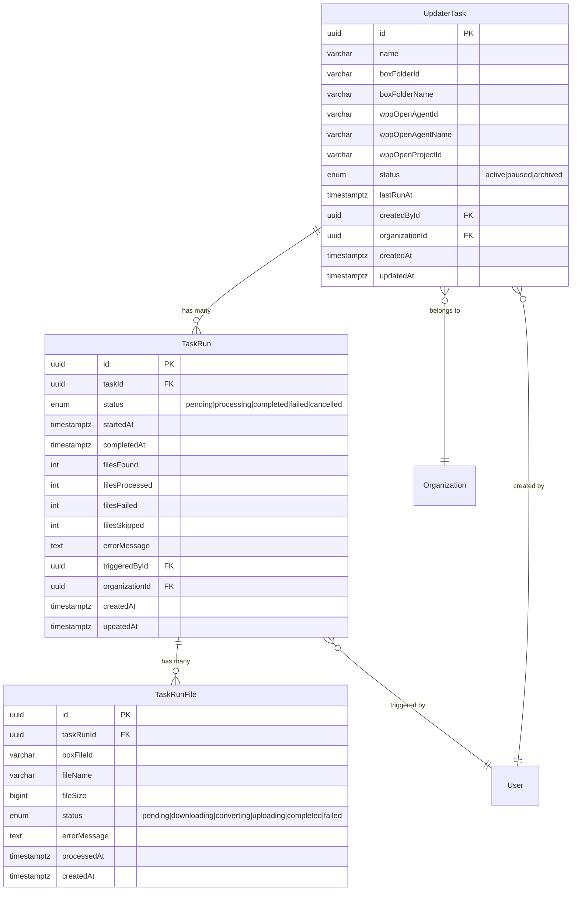

# feat: WPP Open Agent Updater Mini-App

## Overview

A new mini-app that automates syncing documents from Box folders into WPP Open agent knowledge bases. Users configure **tasks** mapping a Box folder to a WPP Open agent, then trigger manual runs that download changed files, convert them to text/markdown via the shared document converter, and upsert them into the agent's knowledge.

This builds on three existing codebases: the document converter (this repo), the Box integration (`vyc-modular-video-builder`), and the WPP Open agent services (`unite-chat-test`).

(see brainstorm: `docs/brainstorms/2026-03-08-wpp-open-agent-updater-brainstorm.md`)

## Problem Statement / Motivation

WPP Open agents need their knowledge bases kept up-to-date with documents stored in Box. Currently this is a manual, tedious process — download files, convert them, navigate the WPP Open interface, and upload individually. This mini-app automates the entire pipeline with a single "Run" button.

## Proposed Solution

A three-featureset mini-app:

1. **Box Folder Connection** — Validate a Box folder ID and preview its contents
2. **WPP Open Agent Selection** — List and select target agents from WPP Open
3. **Task Configuration & Execution** — CRUD for task configs, queue-based run execution, run history with per-file details

Queue-based processing via pg-boss handles large folders without HTTP timeouts and provides a foundation for future scheduled runs.

## Technical Approach

### Architecture

```
┌─────────────────────────────────────────────────────────┐
│  Angular Frontend                                       │
│  ┌──────────────┐  ┌──────────────┐  ┌───────────────┐ │
│  │ Task Config  │  │ Run History  │  │ Run Detail    │ │
│  │ (Create/Edit)│  │ (Summary)    │  │ (Per-file)    │ │
│  └──────┬───────┘  └──────┬───────┘  └───────┬───────┘ │
└─────────┼──────────────────┼──────────────────┼─────────┘
          │ HTTP              │ HTTP              │ HTTP
┌─────────▼──────────────────▼──────────────────▼─────────┐
│  NestJS API (apps/wpp-open-agent-updater)                │
│  ┌──────────────┐  ┌──────────────┐                     │
│  │ Controller   │  │ Run Worker   │                     │
│  │ (CRUD + Run) │  │ (pg-boss)    │                     │
│  └──────┬───────┘  └──────┬───────┘                     │
│         │                  │                             │
│  ┌──────▼──────────────────▼──────────────────────────┐  │
│  │  Services                                          │  │
│  │  ┌─────────┐  ┌──────────┐  ┌─────────────────┐   │  │
│  │  │ Task    │  │ Box      │  │ WPP Open Agent  │   │  │
│  │  │ Service │  │ Service  │  │ Service         │   │  │
│  │  └─────────┘  └──────────┘  └─────────────────┘   │  │
│  └────────────────────────────────────────────────────┘  │
│                          │                               │
│  ┌───────────────────────▼───────────────────────────┐   │
│  │  _platform/ (shared)                              │   │
│  │  ConverterFactory │ PgBossService │ AwsS3Service  │   │
│  └───────────────────────────────────────────────────┘   │
└──────────────────────────────────────────────────────────┘
          │                    │                │
    ┌─────▼─────┐       ┌─────▼─────┐    ┌─────▼─────┐
    │ Box API   │       │ WPP Open  │    │ PostgreSQL│
    │ (files)   │       │ (agents)  │    │ (data)    │
    └───────────┘       └───────────┘    └───────────┘
```

### Implementation Phases

#### Phase 0: Prerequisites — Extract Converter to Platform

**Goal:** Make document conversion services available as shared platform services.

**Tasks:**
- [x] Move `converters/` directory from `apps/api/src/mini-apps/document-converter/` to `apps/api/src/_platform/converters/`
  - Files to move: `base.converter.ts`, `converter.factory.ts`, `docx.converter.ts`, `pdf.converter.ts`, `xlsx.converter.ts`, `pptx.converter.ts`, `pandoc.runner.ts`, `pdf-parse.d.ts`, `index.ts`
- [x] Move `errors/domain.errors.ts` to `apps/api/src/_platform/errors/domain.errors.ts` (shared error hierarchy)
- [x] Update import paths in document-converter module to reference `_platform/converters/`
- [x] Add `ConverterFactory` to `PlatformModule` providers and exports in `apps/api/src/_platform/platform.module.ts`
- [x] Verify document-converter still works after the move — run existing tests

**Success criteria:** Document converter functions identically; `ConverterFactory` injectable from any mini-app via `PlatformModule`.

**Files modified:**
- `apps/api/src/_platform/platform.module.ts` — add ConverterFactory
- `apps/api/src/_platform/converters/` — new directory (moved files)
- `apps/api/src/_platform/errors/` — new directory (moved files)
- `apps/api/src/mini-apps/document-converter/document-converter.module.ts` — update imports
- `apps/api/src/mini-apps/document-converter/services/conversion-worker.service.ts` — update imports

---

#### Phase 1: Scaffold & Data Model

**Goal:** Create the mini-app skeleton and database schema.

**Tasks:**

**1a. Scaffold the mini-app:**
- [x] Run `cd apps/api && npm run console:dev CreateApp` with key `wpp-open-agent-updater`
  - Display name: "WPP Open Agent Updater"
  - Description: "Sync Box folder documents into WPP Open agent knowledge bases"
  - Icon: `pi pi-sync`
  - Skip sample entity (we'll create custom ones)
- [x] Verify `apps/mini-apps.json` updated, `mini-apps.module.ts` wired, `app.routes.ts` route added

**1b. Create entities:**

- [x] `apps/api/src/mini-apps/wpp-open-agent-updater/entities/updater-task.entity.ts`

```typescript
@Entity({ name: 'updater_tasks', schema: 'wpp_open_agent_updater' })
export class UpdaterTask {
  @PrimaryGeneratedColumn('uuid')
  id: string;

  @Column({ length: 255 })
  name: string;

  @Column({ length: 100 })
  boxFolderId: string;

  @Column({ length: 255, nullable: true })
  boxFolderName: string;

  @Column({ length: 100 })
  wppOpenAgentId: string;

  @Column({ length: 255, nullable: true })
  wppOpenAgentName: string;

  @Column({ length: 100 })
  wppOpenProjectId: string;

  @Column({ type: 'enum', enum: ['active', 'paused', 'archived'], default: 'active' })
  status: string;

  @Column({ type: 'timestamptz', nullable: true })
  lastRunAt: Date | null;

  @ManyToOne(() => User, { onDelete: 'CASCADE' })
  @JoinColumn({ name: 'createdById' })
  createdBy: User;

  @Column('uuid')
  createdById: string;

  @ManyToOne(() => Organization, { onDelete: 'CASCADE' })
  @JoinColumn({ name: 'organizationId' })
  organization: Organization;

  @Column('uuid')
  organizationId: string;

  @CreateDateColumn({ type: 'timestamptz' })
  createdAt: Date;

  @UpdateDateColumn({ type: 'timestamptz' })
  updatedAt: Date;
}
```

- [x] `apps/api/src/mini-apps/wpp-open-agent-updater/entities/task-run.entity.ts`

```typescript
@Entity({ name: 'task_runs', schema: 'wpp_open_agent_updater' })
export class TaskRun {
  @PrimaryGeneratedColumn('uuid')
  id: string;

  @ManyToOne(() => UpdaterTask, { onDelete: 'CASCADE' })
  @JoinColumn({ name: 'taskId' })
  task: UpdaterTask;

  @Column('uuid')
  taskId: string;

  @Column({ type: 'enum', enum: ['pending', 'processing', 'completed', 'failed', 'cancelled'], default: 'pending' })
  status: string;

  @Column({ type: 'timestamptz', nullable: true })
  startedAt: Date | null;

  @Column({ type: 'timestamptz', nullable: true })
  completedAt: Date | null;

  @Column({ type: 'int', default: 0 })
  filesFound: number;

  @Column({ type: 'int', default: 0 })
  filesProcessed: number;

  @Column({ type: 'int', default: 0 })
  filesFailed: number;

  @Column({ type: 'int', default: 0 })
  filesSkipped: number;

  @Column({ type: 'text', nullable: true })
  errorMessage: string | null;

  @Column('uuid')
  triggeredById: string;

  @Column('uuid')
  organizationId: string;

  @CreateDateColumn({ type: 'timestamptz' })
  createdAt: Date;

  @UpdateDateColumn({ type: 'timestamptz' })
  updatedAt: Date;
}
```

- [x] `apps/api/src/mini-apps/wpp-open-agent-updater/entities/task-run-file.entity.ts`

```typescript
@Entity({ name: 'task_run_files', schema: 'wpp_open_agent_updater' })
export class TaskRunFile {
  @PrimaryGeneratedColumn('uuid')
  id: string;

  @ManyToOne(() => TaskRun, { onDelete: 'CASCADE' })
  @JoinColumn({ name: 'taskRunId' })
  taskRun: TaskRun;

  @Column('uuid')
  taskRunId: string;

  @Column({ length: 255 })
  boxFileId: string;

  @Column({ length: 500 })
  fileName: string;

  @Column({ type: 'bigint', default: 0 })
  fileSize: number;

  @Column({ type: 'enum', enum: ['pending', 'downloading', 'converting', 'uploading', 'completed', 'failed'], default: 'pending' })
  status: string;

  @Column({ type: 'text', nullable: true })
  errorMessage: string | null;

  @Column({ type: 'timestamptz', nullable: true })
  processedAt: Date | null;

  @CreateDateColumn({ type: 'timestamptz' })
  createdAt: Date;
}
```

**1c. Create migration:**

- [x] `apps/api/migrations/<timestamp>-CreateWppOpenAgentUpdaterSchema.ts`
  - Create schema `wpp_open_agent_updater`
  - Create enum types for task status, run status, file status
  - Create `updater_tasks` table with all columns, indexes, FKs
  - Create `task_runs` table with all columns, indexes, FKs
  - Create `task_run_files` table with all columns, indexes, FKs
  - Follow naming: `idx_woau_<table>_<columns>`, `fk_woau_<table>_<column>`
  - `down()` reverses everything

**1d. Extend pg-boss for new queue:**

- [x] Add queue constants to `apps/api/src/_platform/queue/pg-boss.config.ts`:
  ```typescript
  export const AGENT_UPDATER_QUEUE = 'agent-updater-run';
  ```
- [x] Add job data type to `apps/api/src/_platform/queue/pg-boss.types.ts`:
  ```typescript
  export interface AgentUpdaterJobData {
    taskRunId: string;
    taskId: string;
    boxFolderId: string;
    wppOpenAgentId: string;
    wppOpenProjectId: string;
    userId: string;
    organizationId: string;
    lastRunAt: string | null;
    wppOpenToken: string; // User's session token for this run
  }
  ```
- [x] Add generic `sendJob()` and `workQueue()` methods to `PgBossService` (or add specific `sendAgentUpdaterJob()` / `workAgentUpdaterQueue()` methods following the existing conversion pattern)
- [x] Register the new queue in `ensureQueuesExist()`

**Success criteria:** App scaffolded, entities created, migration runs successfully, new pg-boss queue registered.

---

#### Phase 2: Box Integration Service

**Goal:** Connect to Box API for folder validation, file listing, and downloading.

**Tasks:**

- [ ] Install `box-typescript-sdk-gen` package:
  ```bash
  npm install box-typescript-sdk-gen
  ```

- [ ] Create `apps/api/src/mini-apps/wpp-open-agent-updater/services/box.service.ts`
  - JWT/Enterprise authentication using env vars:
    - `BOX_ENTERPRISE_ID`
    - `BOX_PUBLIC_KEY_ID`
    - `BOX_PRIVATE_KEY`
    - `BOX_PASSPHRASE`
    - `BOX_CLIENT_ID`
    - `BOX_CLIENT_SECRET`
  - Methods:
    - `validateFolder(folderId: string): Promise<{ name: string; fileCount: number }>` — Validate folder exists and return metadata
    - `listFolderFiles(folderId: string, modifiedAfter?: Date): Promise<BoxFile[]>` — Recursively list files, optionally filtered by modification date
    - `downloadFile(fileId: string): Promise<Buffer>` — Download file content as Buffer
  - Rate limiting: Max 8 concurrent API calls using a semaphore/pool pattern
  - Reference implementation: Copy patterns from `/Users/ivan.mayes/Documents/GitHub/vyc-modular-video-builder/apps/api/src/integrations/box/`

- [ ] Add `.env.example` entries for Box env vars

- [ ] Create `apps/api/src/mini-apps/wpp-open-agent-updater/types/box.types.ts`:
  ```typescript
  export interface BoxFile {
    id: string;
    name: string;
    size: number;
    modifiedAt: Date;
    extension: string;
    path: string; // Full folder path
  }
  ```

**Success criteria:** Box service can validate a folder, list files recursively with date filtering, and download individual files.

---

#### Phase 3: WPP Open Agent Service

**Goal:** Connect to WPP Open API for agent listing and knowledge updates.

**Tasks:**

- [ ] Create `apps/api/src/mini-apps/wpp-open-agent-updater/services/wpp-open-agent.service.ts`
  - Uses user's WPP Open JWT token (passed from frontend session)
  - Required headers for CloudFront: `Origin: https://open-web-cs.wpp.ai`, `Referer: https://open-web-cs.wpp.ai/`
  - Methods:
    - `listAgents(token: string, projectId: string): Promise<WppOpenAgent[]>` — List available agents
    - `getAgent(token: string, projectId: string, agentId: string): Promise<WppOpenAgentConfig>` — Get full agent config
    - `updateAgentKnowledge(token: string, projectId: string, agentId: string, knowledge: unknown): Promise<void>` — Upsert knowledge into agent config
    - `resolveProjectId(token: string, osContext: unknown): Promise<string>` — Resolve WPP Open project UUID to CS project ID
  - Base URLs:
    - Agent listing: `https://creative.wpp.ai/v1/aihub/agents`
    - Agent config: `https://creative.wpp.ai/v1/agent-configs/{projectId}/results/{agentId}`
    - Project resolution: `PUT https://creative.wpp.ai/v1/project/external/open`
  - CS Auth scheme: `Authorization: CS {token},hierarchyAzId={azId}`
  - Reference implementation: `/Users/ivan.mayes/Documents/GitHub/unite-chat-test/apps/api/src/agent-chat/agent-chat.service.ts`

- [ ] Create `apps/api/src/mini-apps/wpp-open-agent-updater/types/wpp-open.types.ts`:
  ```typescript
  export interface WppOpenAgent {
    id: string;
    name: string;
    description?: string;
    category?: string;
  }

  export interface WppOpenAgentConfig {
    // Opaque config - structure TBD from API exploration
    [key: string]: unknown;
  }
  ```

- [ ] **API exploration task** (Phase 3 blocker): Before implementing `updateAgentKnowledge()`, explore the WPP Open API to discover how knowledge documents are structured within the agentConfig payload. This may require:
  1. Fetching an existing agent's config to inspect its `knowledge` property structure
  2. Testing a PUT with modified knowledge to confirm the update format
  3. Documenting the discovered structure in the types file

**Success criteria:** Service can list agents, fetch agent configs, and (after API exploration) upsert knowledge documents.

---

#### Phase 4: Task Service & Run Worker

**Goal:** Implement CRUD for tasks and the queue-based run execution pipeline.

**Tasks:**

**4a. Task CRUD service:**

- [ ] Create `apps/api/src/mini-apps/wpp-open-agent-updater/services/updater-task.service.ts`
  - Methods:
    - `createTask(dto, userId, orgId): Promise<UpdaterTask>` — Validate Box folder, create task
    - `listTasks(orgId): Promise<UpdaterTask[]>` — List all tasks for org
    - `getTask(id, orgId): Promise<UpdaterTask>` — Get single task
    - `updateTask(id, dto, orgId): Promise<UpdaterTask>` — Update task config
    - `deleteTask(id, orgId): Promise<void>` — Soft delete (archive)
    - `triggerRun(id, userId, orgId, wppOpenToken): Promise<TaskRun>` — Check no active run exists, verify task is `active`, create TaskRun, send to pg-boss queue

**4b. Run worker service:**

- [ ] Create `apps/api/src/mini-apps/wpp-open-agent-updater/services/run-worker.service.ts`
  - Implements `OnModuleInit` / `OnModuleDestroy` (same pattern as `ConversionWorkerService`)
  - Registers as pg-boss worker for `agent-updater-run` queue
  - Run execution pipeline:
    1. Update TaskRun status to `processing`
    2. Validate WPP Open token (call `/users/me`); fail run immediately if invalid
    3. Call Box service to list files modified after `task.lastRunAt` minus 5-minute buffer (recursive)
    4. Update `TaskRun.filesFound` with count
    5. For each file (concurrency limit of 4):
       a. Create `TaskRunFile` record with status `pending`
       b. Skip if unsupported extension (mark `failed`, "Unsupported file type", increment `filesSkipped`)
       c. Skip if file > 50MB (mark `failed`, "File too large", increment `filesSkipped`)
       d. Download file from Box → status `downloading`
       e. Convert to text/markdown → status `converting`
       f. Upsert into WPP Open agent knowledge → status `uploading`
       g. Mark `completed` or `failed` (with error); increment counters
    6. Update TaskRun to `completed` (or `failed` if zero files succeeded)
    7. Update `task.lastRunAt` to run start time
  - Error handling: Individual file failures don't stop the run; continue processing remaining files
  - Graceful shutdown: Track active runs, abort on module destroy with 30s timeout

**4c. DTOs:**

- [ ] Create `apps/api/src/mini-apps/wpp-open-agent-updater/dtos/`:
  - `create-task.dto.ts` — `name`, `boxFolderId`, `wppOpenAgentId`, `wppOpenProjectId`
  - `update-task.dto.ts` — Partial of create (name, status)
  - `trigger-run.dto.ts` — `wppOpenToken` (user's session token for this run)
  - `task-response.dto.ts` — Response shape for task with run summary
  - `task-run-response.dto.ts` — Response shape for runs with file details

**Success criteria:** Tasks can be created/listed/updated/deleted. Running a task queues a pg-boss job that processes files end-to-end.

---

#### Phase 5: Controller (REST API)

**Goal:** Expose REST endpoints for all operations.

**Tasks:**

- [ ] Create `apps/api/src/mini-apps/wpp-open-agent-updater/wpp-open-agent-updater.controller.ts`

| Method | Endpoint | Purpose |
|--------|----------|---------|
| `POST` | `/apps/wpp-open-agent-updater/tasks` | Create task |
| `GET` | `/apps/wpp-open-agent-updater/tasks` | List tasks for org |
| `GET` | `/apps/wpp-open-agent-updater/tasks/:id` | Get task details |
| `PUT` | `/apps/wpp-open-agent-updater/tasks/:id` | Update task |
| `DELETE` | `/apps/wpp-open-agent-updater/tasks/:id` | Archive task |
| `POST` | `/apps/wpp-open-agent-updater/tasks/:id/run` | Trigger manual run |
| `GET` | `/apps/wpp-open-agent-updater/tasks/:id/runs` | List runs for task |
| `GET` | `/apps/wpp-open-agent-updater/runs/:id` | Get run details (with files) |
| `GET` | `/apps/wpp-open-agent-updater/box/validate/:folderId` | Validate Box folder + preview |
| `GET` | `/apps/wpp-open-agent-updater/agents` | List WPP Open agents |

- All endpoints behind `@UseGuards(AuthGuard())`
- Class-level `@RequiresApp('wpp-open-agent-updater')`
- Route prefix: `apps/wpp-open-agent-updater`
- All responses wrapped in `ResponseEnvelope`
- `@CurrentOrg()` for organization scoping
- WPP Open token passed via `Authorization` header or request body for agent-related endpoints

**Success criteria:** All endpoints functional, auth enforced, org-scoped.

---

#### Phase 6: Frontend (Angular)

**Goal:** Build the Angular UI with task management, run triggering, and history views.

**Tasks:**

**6a. Angular service:**

- [ ] Create `apps/web/src/app/mini-apps/wpp-open-agent-updater/services/wpp-open-agent-updater.service.ts`
  - `@Injectable({ providedIn: 'root' })`
  - Methods mapping to all controller endpoints
  - Types imported from `@api/mini-apps/wpp-open-agent-updater/types/`

**6b. Routes:**

- [ ] Create `apps/web/src/app/mini-apps/wpp-open-agent-updater/wpp-open-agent-updater.routes.ts`
  ```typescript
  export const routes: Routes = [
    { path: '', loadComponent: () => import('./components/task-list.component').then(m => m.TaskListComponent) },
    { path: 'new', loadComponent: () => import('./components/task-form.component').then(m => m.TaskFormComponent) },
    { path: ':taskId', loadComponent: () => import('./components/task-detail.component').then(m => m.TaskDetailComponent) },
    { path: ':taskId/edit', loadComponent: () => import('./components/task-form.component').then(m => m.TaskFormComponent) },
    { path: 'runs/:runId', loadComponent: () => import('./components/run-detail.component').then(m => m.RunDetailComponent) },
  ];
  ```

**6c. Components (all standalone, PrimeNG exclusively):**

- [ ] `task-list.component.ts` — **Main page**
  - `p-table` showing all tasks with columns: Name, Box Folder, Agent, Status, Last Run, Actions
  - "New Task" button → navigates to form
  - "Run" button per task (triggers run via API)
  - "View" link → task detail
  - Status shown via `p-tag` with severity colors

- [ ] `task-form.component.ts` — **Create/Edit task**
  - `pInputText` for task name
  - `pInputText` for Box folder ID + "Validate" button
    - On validate: call API, show folder name + file count preview
  - `p-select` for WPP Open agent (populated from agent list API)
  - Save/Cancel buttons (`p-button`)
  - Form validation with Angular reactive forms

- [ ] `task-detail.component.ts` — **Task detail + run history**
  - Task info header (name, folder, agent, status)
  - "Run Now" button
  - `p-table` of past runs: Date, Status, Files Found/Processed/Failed, Duration
  - Click run → navigates to run detail

- [ ] `run-detail.component.ts` — **Run detail with per-file results**
  - Run summary header (status, timing, file counts)
  - `p-table` of files: Name, Size, Status, Error (if any)
  - Status badges via `p-tag`
  - Polling for in-progress runs (refresh every 5s while status is `processing`)

**6d. Design requirements:**
- All colors via `--p-` design tokens (no hardcoded hex/rgb)
- All interactive elements have `aria-label` where needed
- Use Angular signals for component state
- `inject()` for dependency injection
- `takeUntilDestroyed(this.destroyRef)` for subscription cleanup

**Success criteria:** User can create tasks, validate Box folders, select agents, trigger runs, and view results with per-file details.

---

#### Phase 7: Module Wiring & Integration Testing

**Goal:** Wire everything together and verify end-to-end.

**Tasks:**

- [ ] Update `apps/api/src/mini-apps/wpp-open-agent-updater/wpp-open-agent-updater.module.ts`:
  ```typescript
  @Module({
    imports: [TypeOrmModule.forFeature([UpdaterTask, TaskRun, TaskRunFile])],
    controllers: [WppOpenAgentUpdaterController],
    providers: [
      UpdaterTaskService,
      BoxService,
      WppOpenAgentService,
      RunWorkerService,
    ],
  })
  export class WppOpenAgentUpdaterModule {}
  ```

- [ ] Verify `mini-apps.module.ts` imports `WppOpenAgentUpdaterModule`
- [ ] Verify `app.routes.ts` has lazy-loaded route for `wpp-open-agent-updater`
- [ ] Run migration: `npm run typeorm migration:run`
- [ ] Test end-to-end flow:
  1. Create a task with valid Box folder ID and WPP Open agent
  2. Trigger a run
  3. Verify files are downloaded, converted, and uploaded
  4. Verify run history shows correct stats
  5. Verify per-file details are accurate

**Success criteria:** Full E2E flow works — create task → run → view results.

---

## System-Wide Impact

### Interaction Graph

- Task creation → Box API validation call → DB insert
- Run trigger → pg-boss job enqueue → worker picks up → Box API (list + download) → ConverterFactory (convert) → WPP Open API (upsert) → DB updates (run status, file status)
- Frontend polling → Controller → DB read

### Error & Failure Propagation

- **Box API failures** (auth, rate limit, folder not found): Caught in BoxService, propagated as run-level error
- **Converter failures** (corrupt file, unsupported): Caught per-file, logged in TaskRunFile, run continues
- **WPP Open API failures** (auth expired, API down): Per-file or run-level depending on scope; auth expiry should fail the entire run since the token is session-scoped
- **pg-boss failures**: Job retry with backoff; DLQ after max retries

### State Lifecycle Risks

- **Partial run failure**: TaskRun tracks per-file status; partial success is valid (some files succeed, some fail). `filesProcessed` + `filesFailed` counts are accurate.
- **WPP Open token expiry during long runs**: Token is passed at run trigger time. Long runs (many files) may see token expire mid-run. Mitigation: fail remaining files gracefully, record which succeeded.
- **Concurrent runs of same task**: Prevent by checking for in-progress runs before allowing a new trigger.

### API Surface Parity

- No other mini-app exposes similar agent update functionality
- Box validation endpoint is unique to this mini-app
- All API patterns follow existing document-converter conventions

---

## Acceptance Criteria

### Functional Requirements

- [ ] User can create a task linking a Box folder to a WPP Open agent
- [ ] Box folder ID is validated on entry with name + file count preview
- [ ] WPP Open agents are listed from the API for selection
- [ ] User can trigger a manual run of a task
- [ ] Run processes all files modified since last run (recursive folder traversal)
- [ ] Files are converted using the shared ConverterFactory
- [ ] Converted content is upserted into WPP Open agent knowledge
- [ ] Run history shows summary list (date, status, file counts)
- [ ] Run detail shows per-file results (name, size, status, error)
- [ ] Multiple tasks per organization are supported
- [ ] Tasks can be edited (name, status) and archived

- [ ] Concurrent runs for the same task are rejected (only one active run at a time)
- [ ] Unsupported file types are skipped with clear status in run details
- [ ] Token expiry during a run fails remaining files gracefully (partial success)
- [ ] Only active tasks can be run; paused/archived tasks reject run requests

### Non-Functional Requirements

- [ ] Runs execute asynchronously via pg-boss (no HTTP timeout risk)
- [ ] Individual file failures don't stop the entire run
- [ ] Box API rate limiting enforced (max 8 concurrent calls)
- [ ] All UI uses PrimeNG components and `--p-` design tokens
- [ ] All endpoints org-scoped via `@CurrentOrg()` and `@RequiresApp()`

---

## SpecFlow Analysis Findings

The following gaps were identified during specification analysis and are addressed in this plan:

### Critical: WPP Open Token Lifecycle vs. Queue Worker

The user's WPP Open session token is obtained via frontend iframe bridge (`penpal`). When the user clicks "Run", the frontend must pass a **fresh** WPP Open token with the request. This token is stored on the `AgentUpdaterJobData` and used by the pg-boss worker.

**Risk:** Long runs (many files) may outlast the token's ~1 hour validity.

**Mitigation (V1):** The worker validates the token before starting. If the token expires mid-run, remaining files fail gracefully with a clear "token expired" error. The run completes as partial success. The user can re-run to catch remaining files.

**Future:** Implement server-side token refresh or split runs into smaller batches.

### Important: Concurrent Run Protection

The API must reject a `POST /tasks/:id/run` request if the task already has a run in `pending` or `processing` status. This prevents duplicate file processing and race conditions on `lastRunAt`.

### Important: Change Detection Edge Cases

**Partial failure:** When a run has mixed results (some files succeed, some fail), `lastRunAt` is set to the run's start time. Failed files that were not re-modified in Box will NOT be automatically retried on next run. Users must manually re-run or wait for files to be updated in Box. This is acceptable for V1 simplicity.

**Clock skew:** Use a 5-minute buffer when filtering by `modifiedAfter` (subtract 5 minutes from `lastRunAt`) to account for Box API timestamp differences.

### Important: Unsupported File Handling

Files with extensions not supported by `ConverterFactory` are **skipped** — recorded in `TaskRunFile` with status `failed` and error "Unsupported file type". They are counted in `filesFound` but not in `filesProcessed` or `filesFailed`. A separate `filesSkipped` count is added to `TaskRun`.

### Moderate: Task Status State Machine

```
active ←→ paused → archived (terminal)
```

- Only `active` tasks can be run
- `paused` tasks cannot be run but can be reactivated
- `archived` is terminal (soft delete)
- Archiving a task cancels any in-progress runs
- Any org member can view and run tasks (org-scoped, not user-scoped)

### Moderate: Intermediate File Storage

Files are downloaded from Box into **memory buffers** and passed directly to the converter. No intermediate S3 or disk storage. This matches the document converter pattern. Individual file size is limited to 50MB (same as document converter).

### Moderate: Frontend Status Updates

V1 uses **polling** (every 5 seconds while a run is `processing`) rather than SSE. This is simpler to implement and sufficient for manual runs. SSE can be added later if needed.

### Moderate: Data Retention

Run history has no auto-cleanup in V1. TaskRun and TaskRunFile records accumulate. Future consideration: add a retention policy (e.g., keep last 50 runs per task).

---

## Dependencies & Risks

| Dependency | Risk | Mitigation |
|------------|------|------------|
| **WPP Open knowledge structure** (OPEN QUESTION) | Cannot implement upsert without knowing the format | Phase 3 includes API exploration task; build service interface first |
| **Box API credentials** | Need JWT/Enterprise env vars configured | Add to `.env.example`; validate on service init |
| **WPP Open token lifetime** | Long runs may outlast token | Fail gracefully; record partial progress |
| **Document converter extraction** | Moving shared code risks breaking existing app | Phase 0 is isolated; verify with existing tests |
| **`box-typescript-sdk-gen` package** | New dependency | Well-maintained, already used in another VML project |

---

## Data Model (ERD)



---

## New Files Summary

### API (`apps/api/src/mini-apps/wpp-open-agent-updater/`)

| File | Purpose |
|------|---------|
| `wpp-open-agent-updater.module.ts` | NestJS module (scaffolded) |
| `wpp-open-agent-updater.controller.ts` | REST endpoints |
| `entities/updater-task.entity.ts` | Task configuration entity |
| `entities/task-run.entity.ts` | Run execution history entity |
| `entities/task-run-file.entity.ts` | Per-file result entity |
| `services/updater-task.service.ts` | Task CRUD + run triggering |
| `services/box.service.ts` | Box API integration |
| `services/wpp-open-agent.service.ts` | WPP Open agent API integration |
| `services/run-worker.service.ts` | pg-boss worker for run execution |
| `dtos/create-task.dto.ts` | Create task DTO |
| `dtos/update-task.dto.ts` | Update task DTO |
| `dtos/trigger-run.dto.ts` | Trigger run DTO |
| `dtos/task-response.dto.ts` | Task response shape |
| `dtos/task-run-response.dto.ts` | Run response shape |
| `types/box.types.ts` | Box file types |
| `types/wpp-open.types.ts` | WPP Open agent types |
| `types/task-status.enum.ts` | Task status enum |
| `types/run-status.enum.ts` | Run status enum |
| `types/file-status.enum.ts` | File processing status enum |
| `AGENTS.md` | AI agent rules for this mini-app |

### Web (`apps/web/src/app/mini-apps/wpp-open-agent-updater/`)

| File | Purpose |
|------|---------|
| `wpp-open-agent-updater.routes.ts` | Route definitions |
| `services/wpp-open-agent-updater.service.ts` | HTTP service |
| `components/task-list.component.ts` | Main task list page |
| `components/task-form.component.ts` | Create/edit task form |
| `components/task-detail.component.ts` | Task detail + run history |
| `components/run-detail.component.ts` | Run detail with per-file results |
| `AGENTS.md` | AI agent rules for frontend |

### Platform (`apps/api/src/_platform/`)

| File | Purpose |
|------|---------|
| `converters/` (moved from document-converter) | Shared converter services |
| `errors/domain.errors.ts` (moved) | Shared error hierarchy |

### Migration

| File | Purpose |
|------|---------|
| `apps/api/migrations/<timestamp>-CreateWppOpenAgentUpdaterSchema.ts` | Schema + tables |

### Config

| File | Purpose |
|------|---------|
| `apps/api/src/_platform/queue/pg-boss.config.ts` | New queue constant |
| `apps/api/src/_platform/queue/pg-boss.types.ts` | New job data type |

**Total: ~30 new files + ~5 modified files**

---

## Sources & References

### Origin

- **Brainstorm document:** [docs/brainstorms/2026-03-08-wpp-open-agent-updater-brainstorm.md](docs/brainstorms/2026-03-08-wpp-open-agent-updater-brainstorm.md) — Key decisions carried forward: queue-based processing, extract converter to platform, validate+preview Box folders, WPP Open project context from session

### Internal References

- Document converter module: `apps/api/src/mini-apps/document-converter/document-converter.module.ts`
- pg-boss service: `apps/api/src/_platform/queue/pg-boss.service.ts`
- Platform module: `apps/api/src/_platform/platform.module.ts`
- Converter factory: `apps/api/src/mini-apps/document-converter/converters/converter.factory.ts`
- Controller pattern: `apps/api/src/mini-apps/document-converter/document-converter.controller.ts`
- Migration pattern: `apps/api/migrations/1709836800000-CreateDocumentConverterSchema.ts`
- Web service pattern: `apps/web/src/app/mini-apps/document-converter/services/document-converter.service.ts`
- WPP Open client: `apps/api/src/_core/third-party/wpp-open/index.ts`

### External Codebases

- Box integration reference: `/Users/ivan.mayes/Documents/GitHub/vyc-modular-video-builder/apps/api/src/integrations/box/`
- WPP Open agent services: `/Users/ivan.mayes/Documents/GitHub/unite-chat-test/apps/api/src/agent-chat/`

### Related Work

- Document converter brainstorm: `docs/brainstorms/2026-03-07-document-converter-app-brainstorm.md`
- Document converter plan: `docs/plans/2026-03-07-feat-document-converter-mini-app-plan.md`
