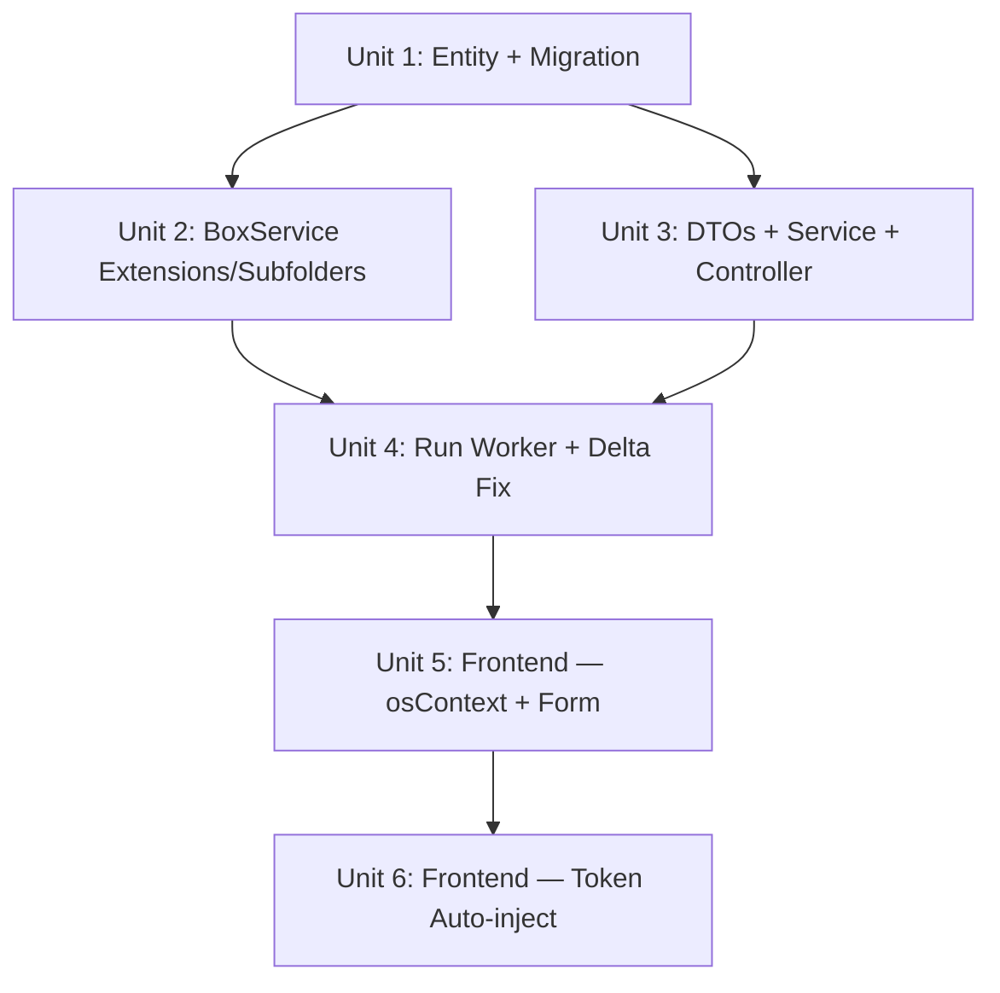

# feat: WPP Open Agent Updater — osContext, Extensions, Subfolders, Cadence & Delta Sync

## Overview

Six improvements to the existing WPP Open Agent Updater mini-app:

1. **Auto-populate Open Project ID** from osContext (editable)
2. **Auto-populate Open Token** from osContext (no more manual prompt dialogs)
3. **Configurable file extensions** per task (multi-select from supported list)
4. **Include subfolders toggle** per task
5. **Cadence field** on task entity (manual-only for now, future: scheduled)
6. **Delta sync** — fix `lastRunAt` bug and verify change detection works correctly

## Problem Frame

The current implementation requires users to manually enter the WPP Open project ID and paste tokens via browser `prompt()` dialogs — a poor UX when this data is already available from the osContext iframe bridge. File extension filtering is hardcoded in BoxService, subfolders are always included with no opt-out, and there's no cadence field for future scheduling support. Additionally, `lastRunAt` updates even on failed runs, causing the delta sync cursor to advance past files that were never successfully processed. These improvements make the app more usable, fix data loss risks, and prepare it for automated runs.

## Requirements Trace

- R1. Project ID auto-populated from `osContext.project.id`, editable on the create form; immutable after creation
- R2. WPP Open token obtained from `WppOpenService.getAccessToken()` automatically — no prompt dialogs
- R3. Task-level file extension selection via multi-select (`.docx`, `.pdf`, `.pptx`, `.xlsx`); at least one required
- R4. Task-level boolean toggle for including/excluding subfolders
- R5. Cadence field on entity (`manual` only for now) — UI shows dropdown but only manual is available
- R6. Only files modified since last **successful** run are reconverted/uploaded (fix existing bug + verify correctness)

## Scope Boundaries

- Scheduled/automatic cadence options are **not** implemented — only the `manual` value is valid. The field exists for future use.
- No service account token storage — runs always use the user's fresh osContext token
- No changes to the document converter or ConverterFactory
- No changes to Box authentication (still JWT/Enterprise)
- No per-file hash tracking — timestamp-based delta detection is sufficient for V1
- Core task fields (`boxFolderId`, `wppOpenAgentId`, `wppOpenProjectId`) remain **immutable after creation** — to change these, create a new task. The edit form disables these fields.
- New config fields (`fileExtensions`, `includeSubfolders`, `cadence`) are **mutable after creation** and can be edited via the task edit form.

## Context & Research

### Relevant Code and Patterns

- **osContext source**: `apps/web/src/app/_core/services/wpp-open/wpp-open.service.ts` — `getAccessToken()` and `context.project.id`
- **App init flow**: `apps/web/src/app/app.component.ts:84-151` — extracts token, workspace scope, project ID at iframe connect
- **JWT embedding**: `apps/api/src/user/user-auth.controller.ts:645` — `wppOpenToken` embedded in JWT payload (stale by design; **not** used as run-time token source)
- **Current token prompt**: `task-list.component.ts` and `task-detail.component.ts` use `prompt()` — to be replaced
- **Box extension filter**: `apps/api/src/mini-apps/wpp-open-agent-updater/services/box.service.ts` — hardcoded `SUPPORTED_EXTENSIONS` set in `scanFolder()`
- **Box recursion**: `box.service.ts:scanFolder()` — always recurses into subfolders, no toggle
- **Entity**: `apps/api/src/mini-apps/wpp-open-agent-updater/entities/updater-task.entity.ts` — missing `fileExtensions`, `includeSubfolders`, `cadence`
- **Run worker**: `apps/api/src/mini-apps/wpp-open-agent-updater/services/run-worker.service.ts` — uses `lastRunAt` minus 5-min buffer for delta detection; **bug at line ~269**: `lastRunAt` updates unconditionally regardless of run success/failure
- **updateTask service**: `apps/api/src/mini-apps/wpp-open-agent-updater/services/updater-task.service.ts` — `updateTask()` only applies `name` and `status`; must be extended for new fields
- **listAgents endpoint**: Controller passes token as query parameter (`?token=...`) — security concern, leaks to logs

### Institutional Learnings

- **PrimeFlex broken in PrimeNG v20 + Tailwind v4**: All new UI must use Tailwind CSS v4 classes, not PrimeFlex. Use `flex-col` not `flex-column`, `grow` not `flex-grow-1`, `grid grid-cols-N gap-4` not `col-12 md:col-3`. (see `docs/solutions/ui-bugs/primeflex-classes-not-available-in-primeng-v20-tailwind-stack-2026-04-01.md`)
- **WPP Open hierarchy gotcha**: Use `context.hierarchy` not deprecated `context.workspace`. Tenant-level assignments have no `workspaceId`.

## Key Technical Decisions

- **Token from osContext, not prompt() or JWT**: The `WppOpenService.getAccessToken()` provides a fresh token from the iframe bridge. The JWT-embedded `wppOpenToken` is stale by design (set at login time, expires within ~1 hour) and must **not** be used as a fallback for run triggering. `TriggerRunDto.wppOpenToken` remains `@IsNotEmpty()` — the frontend is always responsible for providing a fresh token. Falls back to manual entry if not in iframe context (standalone dev mode).
- **Project ID from osContext, editable**: Auto-populate from `wppOpenService.context.project.id` but render as a standard editable input so the user can override for edge cases.
- **Extensions stored as `jsonb` array**: Store `fileExtensions` as a `@Column({ type: 'jsonb' })` on `UpdaterTask`. Default to all 4 supported extensions. Using `jsonb` instead of `simple-array` because: (a) `simple-array` deserializes empty arrays as `['']` (one empty string), not `[]`; (b) `jsonb` is PostgreSQL-native with proper array semantics; (c) no comma-in-value edge cases.
- **Subfolder toggle**: Boolean `includeSubfolders` column on `UpdaterTask`, default `true` (preserves current behavior). When false, BoxService skips recursion.
- **Cadence as varchar**: String column with values `manual` (future: `hourly`, `daily`, `weekly`). Only `manual` is valid for now. UI shows the field but only manual is selectable.
- **Delta sync via lastRunAt — fix bug**: Update `lastRunAt` only on run success (`COMPLETED` status), not on failure or cancellation. The existing code has two `lastRunAt` update sites: (1) ~line 149 inside the `files.length === 0` early return — this is correct since a zero-files run is a successful completion and should advance the cursor; (2) ~line 269 after file processing — this must be guarded by `finalStatus === TaskRunStatus.COMPLETED`. Without this fix, a failed run advances the cursor past files that were never processed, causing silent data loss on the next run.
- **listAgents token via POST body**: Move the WPP Open token from query parameter to POST body on the `listAgents` endpoint. Auto-population means this fires on every form load, increasing credential exposure in URL logs.
- **Confirmation dialog before runs**: Since removing `prompt()` eliminates the implicit confirmation gate, add a lightweight PrimeNG `confirmDialog` before triggering runs.
- **Reactive agent reload on project ID change**: When the user changes `wppOpenProjectId` in the form, clear the current agent selection and reload the agent list for the new project. This prevents cross-project agent references.
- **Agent name in create payload**: The task form already loads agents with names. Include `wppOpenAgentName` in the create DTO so the entity's existing `wppOpenAgentName` column is populated.

## Open Questions

### Resolved During Planning

- **Token expiry for scheduled runs**: Forced to manual cadence only, ensuring a fresh token on each user-initiated run. Scheduled cadence deferred until service account credentials are available.
- **Extension validation**: Multi-select from predefined list with `@ArrayMinSize(1)` ensures at least one converter-supported extension is selected. No arbitrary input.
- **Default subfolder behavior**: Default to `true` (include subfolders) to preserve existing behavior for existing tasks.
- **JWT token as fallback**: Rejected. The JWT-embedded token is stale (~1 hour lifetime, set at login). The frontend must always supply a fresh token via `getAccessToken()`. The `TriggerRunDto.wppOpenToken` stays `@IsNotEmpty()`.
- **Core field immutability**: `boxFolderId`, `wppOpenAgentId`, `wppOpenProjectId` are immutable after creation. Users create a new task to change these. Edit form disables these fields.
- **`simple-array` vs `jsonb`**: Using `jsonb` to avoid `simple-array`'s empty-array deserialization bug (`['']` instead of `[]`) and for PostgreSQL-native array handling.

### Deferred to Implementation

- **Migration for existing tasks**: Existing tasks will need default values for new columns. The migration should set `fileExtensions` to all 4 extensions (as jsonb), `includeSubfolders` to true, and `cadence` to 'manual'.
- **Standalone dev mode token fallback**: When not running inside WPP Open iframe, `getAccessToken()` will fail. Components should detect this and show a manual token input as fallback.
- **Web service type duplication**: The Angular service defines local interfaces that duplicate API types (pre-existing violation of AGENTS.md). Not fixing in this plan but new fields must be added in sync to both API and web types.

## Implementation Units

> **Sequencing note:** Unit 2 changes the `listFolderFiles()` signature, which breaks the call site in `run-worker.service.ts`. Unit 4 updates that call site. These two units cannot be shipped independently — Unit 4 must immediately follow Unit 2 to restore compilation.

- [x] **Unit 1: Entity Schema + Migration**

  **Goal:** Add `fileExtensions`, `includeSubfolders`, and `cadence` columns to the `UpdaterTask` entity and create the migration.

  **Requirements:** R3, R4, R5

  **Dependencies:** None

  **Files:**
  - Modify: `apps/api/src/mini-apps/wpp-open-agent-updater/entities/updater-task.entity.ts`
  - Create: `apps/api/migrations/<timestamp>-AddTaskConfigColumns.ts`

  **Approach:**
  - Add `fileExtensions` as `@Column({ type: 'jsonb', default: () => "'[\"docx\",\"pdf\",\"pptx\",\"xlsx\"]'" })` — uses raw SQL expression to ensure TypeORM emits a valid jsonb DEFAULT that matches the migration
  - Add `includeSubfolders` as `@Column({ type: 'boolean', default: true })`
  - Add `cadence` as `@Column({ length: 50, default: 'manual' })`
  - Migration adds all three columns with `ALTER TABLE` using `DEFAULT` values so existing rows are populated
  - Migration default for jsonb: `'["docx","pdf","pptx","xlsx"]'::jsonb`
  - No enum type needed for cadence — plain varchar keeps it flexible for future values

  **Patterns to follow:**
  - Existing entity column patterns in `updater-task.entity.ts`
  - Migration pattern in `apps/api/migrations/`

  **Test scenarios:**
  - Happy path: Migration runs successfully on existing database with tasks, new columns populated with defaults
  - Happy path: Entity loads with new fields typed correctly (`fileExtensions` as `string[]`, `includeSubfolders` as boolean)
  - Happy path: `fileExtensions` round-trips correctly through TypeORM (write `['pdf','docx']`, read back `['pdf','docx']`)
  - Edge case: Rollback migration drops columns cleanly

  **Verification:**
  - Migration runs without error; existing tasks retain all data and have sensible defaults for new columns

---

- [x] **Unit 2: BoxService — Accept Extensions and Subfolder Toggle**

  **Goal:** Make `listFolderFiles()` and `scanFolder()` accept extensions and subfolder parameters instead of using hardcoded values.

  **Requirements:** R3, R4

  **Dependencies:** Unit 1

  **Files:**
  - Modify: `apps/api/src/mini-apps/wpp-open-agent-updater/services/box.service.ts`

  **Approach:**
  - Change `listFolderFiles(folderId, modifiedAfter?)` signature to `listFolderFiles(folderId, options: { modifiedAfter?: Date; extensions?: string[]; includeSubfolders?: boolean })`
  - Pass `extensions` to `scanFolder()` — replace hardcoded `SUPPORTED_EXTENSIONS` check with dynamic set built from the parameter (default to all 4 if not provided)
  - Normalize extensions: ensure matching works with or without leading dots (e.g., `'pdf'` normalized to `'.pdf'`)
  - When `includeSubfolders` is false, skip the recursion branch in `scanFolder()` — only process files in the top-level folder
  - Keep `SUPPORTED_EXTENSIONS` as a constant for DTO validation/reference but don't use it as the runtime filter source

  **Patterns to follow:**
  - Existing `scanFolder()` recursive pattern in `box.service.ts`

  **Test scenarios:**
  - Happy path: List files with `extensions: ['pdf', 'docx']` returns only PDF and DOCX files
  - Happy path: `includeSubfolders: false` returns only top-level files, ignoring nested folders
  - Happy path: `includeSubfolders: true` (default) recurses as before
  - Edge case: Extensions without dots (e.g., `'pdf'`) are normalized to `.pdf` for matching
  - Integration: Extensions and subfolder toggle work together with `modifiedAfter` date filtering

  **Verification:**
  - BoxService correctly filters by provided extensions and respects subfolder toggle; existing behavior preserved when defaults are used

---

- [x] **Unit 3: DTOs + Service + Controller Updates**

  **Goal:** Update CreateTaskDto, UpdateTaskDto, UpdaterTaskService, and controller to handle new fields. Add `wppOpenAgentName` to create DTO. Move `listAgents` token from query param to POST body.

  **Requirements:** R1, R3, R4, R5

  **Dependencies:** Unit 1

  **Files:**
  - Modify: `apps/api/src/mini-apps/wpp-open-agent-updater/dtos/create-task.dto.ts`
  - Modify: `apps/api/src/mini-apps/wpp-open-agent-updater/dtos/update-task.dto.ts`
  - Modify: `apps/api/src/mini-apps/wpp-open-agent-updater/services/updater-task.service.ts`
  - Modify: `apps/api/src/mini-apps/wpp-open-agent-updater/wpp-open-agent-updater.controller.ts`

  **Approach:**
  - **CreateTaskDto**: Add `fileExtensions` (optional string array with DTO-level default `['docx','pdf','pptx','xlsx']` to prevent TypeORM from sending NULL and overriding the DB default, `@ArrayMinSize(1)`, each `@IsIn(['docx','pdf','pptx','xlsx'])`)., `includeSubfolders` (optional boolean, default true), `cadence` (optional string, `@IsIn(['manual'])`), `wppOpenAgentName` (optional string, max 255). Add `@Matches(/^[a-zA-Z0-9-]+$/)` format validation on `wppOpenProjectId` to prevent path injection via crafted project IDs.
  - **UpdateTaskDto**: Add `fileExtensions`, `includeSubfolders`, `cadence` as optional updates. Core fields (`boxFolderId`, `wppOpenAgentId`, `wppOpenProjectId`) remain excluded — immutable after creation.
  - **UpdaterTaskService.createTask()**: Add `wppOpenAgentName: dto.wppOpenAgentName` to the `taskRepo.create()` call so the agent display name is persisted on creation.
  - **UpdaterTaskService.updateTask()**: Extend to apply `fileExtensions`, `includeSubfolders`, and `cadence` from the DTO, following the same conditional assignment pattern as `name` (line ~112: `if (dto.fileExtensions !== undefined) task.fileExtensions = dto.fileExtensions;`)
  - **Controller listAgents**: Change from `GET /agents?projectId=...&token=...` to `POST /agents` with `{ projectId, wppOpenToken }` in the body. Add `@CurrentOrg()` for org-scoped authorization (defense in depth — matches all other endpoints in this controller). This removes the token from URL query strings (security: prevents credential leakage to access logs, browser history, and proxies).
  - **No JWT token fallback** on `triggerRun` — `TriggerRunDto.wppOpenToken` stays `@IsNotEmpty()`

  **Patterns to follow:**
  - Existing DTO validation patterns in `create-task.dto.ts`
  - `class-validator` decorators: `@IsArray()`, `@ArrayMinSize()`, `@IsIn()`, `@IsBoolean()`, `@IsOptional()`
  - Conditional field assignment in `updater-task.service.ts:updateTask()`

  **Test scenarios:**
  - Happy path: Create task with `fileExtensions: ['pdf', 'docx']` persists correctly
  - Happy path: Create task without `fileExtensions` defaults to all 4
  - Error path: Create task with `fileExtensions: ['txt']` (unsupported) returns validation error
  - Error path: Create task with `fileExtensions: []` (empty) returns validation error
  - Happy path: Update task to change `includeSubfolders` from true to false
  - Happy path: Update task to change `fileExtensions` — new value persists
  - Error path: Create task with `cadence: 'hourly'` returns validation error (only `'manual'` allowed)
  - Happy path: Create task with `wppOpenAgentName` — name persisted to entity
  - Happy path: `POST /agents` with token in body returns agent list
  - Error path: `GET /agents?token=...` (old route) returns 404 or method not allowed

  **Verification:**
  - All new fields accepted in create/update, validated correctly, persisted to entity. `updateTask()` correctly applies new fields. `listAgents` no longer leaks tokens in URLs.

---

- [x] **Unit 4: Run Worker — Pass New Config + Fix Delta Sync Bug**

  **Goal:** Update the run worker to read `fileExtensions` and `includeSubfolders` from the task entity and pass them to BoxService. Fix `lastRunAt` to only update on successful runs.

  **Requirements:** R3, R4, R6

  **Dependencies:** Units 2, 3

  **Files:**
  - Modify: `apps/api/src/mini-apps/wpp-open-agent-updater/services/run-worker.service.ts`
  - Modify: `apps/api/src/mini-apps/wpp-open-agent-updater/services/updater-task.service.ts`
  - Modify: `apps/api/src/_platform/queue/pg-boss.types.ts` *(pre-existing boundary exception — `AgentUpdaterJobData` is app-specific in name but lives in shared platform types)*

  **Approach:**
  - Add `fileExtensions: string[]` and `includeSubfolders: boolean` to `AgentUpdaterJobData` interface
  - In `UpdaterTaskService.triggerRun()`, include the task's `fileExtensions` and `includeSubfolders` in the job data sent to pg-boss
  - In `RunWorkerService.processRun()`, pass these values to `boxService.listFolderFiles()` via the new options parameter. Destructure with graceful defaults for in-flight jobs that lack new fields: `const { fileExtensions = ['docx','pdf','pptx','xlsx'], includeSubfolders = true } = data;`
  - Before passing extensions to BoxService, intersect with `SUPPORTED_EXTENSIONS` at the service layer to ensure only converter-supported extensions are used, regardless of how the data was written to the entity.
  - **Fix delta sync bug**: Guard the `lastRunAt` update at ~line 269: only update when `finalStatus === TaskRunStatus.COMPLETED`. The zero-files early return at ~line 149 is correct (successful completion) and should remain unchanged. Failed/cancelled runs must not advance the delta cursor, otherwise files from the failed run will be silently skipped on the next run.

  **Patterns to follow:**
  - Existing `processRun()` pipeline in `run-worker.service.ts`
  - Job data passing pattern in `updater-task.service.ts:triggerRun()`

  **Test scenarios:**
  - Happy path: Run with task configured for `['pdf']` only processes PDF files from Box
  - Happy path: Run with `includeSubfolders: false` only scans root folder
  - Happy path: Second run after no file changes finds zero files to process
  - Integration: Job data correctly carries `fileExtensions` and `includeSubfolders` from task through pg-boss queue to worker
  - Edge case: Task with `lastRunAt` set — only files modified after that timestamp (minus buffer) are processed
  - **Error path: Failed run does NOT update `lastRunAt`** — next run re-processes the same files
  - **Edge case: Cancelled run does NOT update `lastRunAt`**

  **Verification:**
  - Worker respects per-task extension and subfolder settings; delta sync correctly skips unmodified files; failed runs do not advance the delta cursor

---

- [x] **Unit 5: Frontend — osContext Auto-Population + Form Updates**

  **Goal:** Auto-populate project ID from osContext, add file extensions multi-select, subfolder toggle, and cadence dropdown to the task form. Add reactive agent reload on project ID change. Show task config on detail page.

  **Requirements:** R1, R3, R4, R5

  **Dependencies:** Unit 3

  **Files:**
  - Modify: `apps/web/src/app/mini-apps/wpp-open-agent-updater/components/task-form/task-form.component.ts`
  - Modify: `apps/web/src/app/mini-apps/wpp-open-agent-updater/components/task-detail/task-detail.component.ts`
  - Modify: `apps/web/src/app/mini-apps/wpp-open-agent-updater/services/wpp-open-agent-updater.service.ts`

  **Approach:**
  - **Inject WppOpenService** into TaskFormComponent
  - **Auto-populate project ID**: On init, check `wppOpenService.context?.project?.id`. If available, pre-fill the `wppOpenProjectId` form control. If null (not in iframe or penpal not resolved yet), leave blank for manual entry. No loading spinner — treat it like standalone dev mode.
  - **Auto-load agents**: When project ID is populated (from osContext or manual), obtain token from `wppOpenService.getAccessToken()` and auto-load the agent list. On failure, show an inline error below the agent dropdown with a "Retry" button. Keep a manual retry affordance even when auto-load succeeds (for project ID changes).
  - **Reactive agent reload**: Listen for `valueChanges` on the `wppOpenProjectId` form control with debounce (500ms) and minimum length check (UUID format). When it changes, clear the current agent selection and reload agents for the new project. This prevents cross-project agent references and avoids firing API calls on every keystroke during manual entry.
  - **File extensions multi-select**: Add `p-multiSelect` bound to `fileExtensions` form control. Options: `[{label: 'PDF (.pdf)', value: 'pdf'}, {label: 'Word (.docx)', value: 'docx'}, {label: 'PowerPoint (.pptx)', value: 'pptx'}, {label: 'Excel (.xlsx)', value: 'xlsx'}]`. Default: all selected. Validate at least one selected.
  - **Subfolder toggle**: Add `p-toggleSwitch` (PrimeNG v20 component) bound to `includeSubfolders` form control. Default: true. Label: "Include subfolders"
  - **Cadence dropdown**: Add `p-select` bound to `cadence` form control. Options: `[{label: 'Manual', value: 'manual'}]`. Default: 'manual'. Disabled appearance since only one option.
  - **Agent name**: When user selects an agent from the dropdown, store both `wppOpenAgentId` and `wppOpenAgentName` in the form and include in the create payload.
  - **Edit mode**: Pre-fill all new fields from existing task data. Disable core fields (`boxFolderId`, `wppOpenAgentId`, `wppOpenProjectId`) — these are immutable after creation.
  - **Task detail page**: Display `fileExtensions`, `includeSubfolders`, and `cadence` in the task header section so users can see the config when reviewing runs.
  - **Update service interface**: Add `fileExtensions`, `includeSubfolders`, `cadence` to the `UpdaterTask` interface. Change `listAgents()` to use POST with token in body (matching Unit 3 controller change). Add `wppOpenAgentName` to create request type.
  - **Tailwind CSS v4**: All new layout uses Tailwind classes (`flex`, `flex-col`, `gap-4`, `grid grid-cols-2`, etc.), not PrimeFlex

  **Patterns to follow:**
  - Existing form field patterns in `task-form.component.ts`
  - PrimeNG standalone component imports
  - Angular signals for component state
  - `takeUntilDestroyed(this.destroyRef)` for subscription cleanup
  - Tailwind v4 layout classes (per institutional learning)

  **Test scenarios:**
  - Happy path: In WPP Open iframe, project ID auto-populates from osContext on form load
  - Happy path: User can edit auto-populated project ID
  - Happy path: Changing project ID clears agent selection and reloads agent list
  - Happy path: File extensions multi-select shows all 4 options, all selected by default
  - Happy path: Deselecting some extensions is saved correctly
  - Error path: Cannot save with zero extensions selected (validation)
  - Happy path: Subfolder toggle defaults to on, can be toggled off
  - Happy path: Cadence shows "Manual" as only option
  - Edge case: Not in iframe (standalone dev) — project ID field is empty, user fills manually; token input appears for agent loading
  - Happy path: Edit mode pre-fills all new fields from existing task data; core fields are disabled
  - Happy path: Agent auto-load failure shows inline error with retry button
  - Happy path: Task detail page shows extensions, subfolder toggle, and cadence in header

  **Verification:**
  - Form shows all new fields with correct defaults; osContext auto-population works in iframe; form submits with new fields included; edit mode disables core fields; task detail displays config

---

- [x] **Unit 6: Frontend — Token Auto-Inject for Runs**

  **Goal:** Replace `prompt()` dialogs with automatic token injection from osContext when triggering runs. Add confirmation dialog.

  **Requirements:** R2

  **Dependencies:** Unit 5

  **Files:**
  - Modify: `apps/web/src/app/mini-apps/wpp-open-agent-updater/components/task-list/task-list.component.ts`
  - Modify: `apps/web/src/app/mini-apps/wpp-open-agent-updater/components/task-detail/task-detail.component.ts`

  **Approach:**
  - **Inject WppOpenService** and PrimeNG `ConfirmationService` into both components
  - **Confirmation dialog**: When the user clicks "Run", show a `confirmDialog` ("Run task 'X' now? This will sync files to the agent's knowledge base.") before proceeding. This replaces the implicit gate that `prompt()` provided.
  - **Auto-inject token**: On confirmation, call `wppOpenService.getAccessToken()` to get a fresh token. If successful, pass it directly to `triggerRun()`. Show a brief loading indicator during the async token fetch.
  - **Fallback for standalone dev**: If `getAccessToken()` fails (not in iframe), show a PrimeNG `p-dialog` with a token input field and submit button — replacing the raw `prompt()` with proper UI.
  - **Remove the manual token prompt**: Delete the `prompt('Enter WPP Open token')` calls
  - **Error handling**: If token retrieval fails and user provides no manual fallback, show a `p-message` explaining the context

  **Patterns to follow:**
  - Existing run trigger patterns in `task-list.component.ts` and `task-detail.component.ts`
  - Angular signals for loading/error state
  - PrimeNG `ConfirmDialog` and `p-dialog` components
  - PrimeNG `p-toast` or `p-message` for error feedback

  **Test scenarios:**
  - Happy path: Clicking "Run" shows confirmation dialog; on confirm, obtains token automatically and triggers the run
  - Happy path: Clicking "Cancel" on confirmation dialog does not trigger a run
  - Happy path: Run succeeds end-to-end with auto-injected token
  - Error path: Not in iframe — token retrieval fails, user sees PrimeNG dialog with token input field
  - Error path: Token is expired or invalid — run fails with clear error message from API
  - Edge case: Multiple rapid "Run" clicks — confirmation dialog prevents double-triggering; existing concurrent run protection also applies

  **Verification:**
  - No more `prompt()` dialogs; runs trigger with confirmation step in WPP Open iframe context; graceful PrimeNG fallback dialog in standalone mode

## System-Wide Impact

- **Interaction graph:** Task form now depends on `WppOpenService` (platform-level) for osContext and token. Run trigger in task-list and task-detail also depend on `WppOpenService`. BoxService API changes are internal to the mini-app. `listAgents` endpoint changes from GET to POST (breaking change for any external consumers — but this is an internal-only endpoint).
- **Error propagation:** Token retrieval failure from iframe is a new error path — must fail gracefully to manual fallback, not crash the component. Auto-load agents failure shows inline error with retry.
- **State lifecycle risks:** The `lastRunAt` bug fix (Unit 4) changes when the delta cursor advances. Failed runs will no longer advance it, which means the next successful run may process more files than before. This is the correct behavior.
- **API surface parity:** New fields in create/update DTOs are additive and optional with defaults — backward compatible. The `listAgents` endpoint changes from GET to POST — a breaking change that must be deployed API+web simultaneously.
- **Integration coverage:** The BoxService options parameter change must be tested end-to-end through the run worker pipeline, not just in isolation. The `lastRunAt` fix must be verified with a failed-run-then-retry scenario.
- **Unchanged invariants:** Box JWT/Enterprise auth, WPP Open CS auth scheme, pg-boss queue architecture, run concurrency protection, 50MB file size limit — all unchanged.
- **Platform file boundary exception:** `AgentUpdaterJobData` in `apps/api/src/_platform/queue/pg-boss.types.ts` is a pre-existing boundary exception — app-specific interface in shared platform types. This plan adds two fields to it. Consider migrating this interface into the mini-app's own types in a future cleanup.

## Risks & Dependencies

| Risk | Mitigation |
|------|------------|
| `WppOpenService.getAccessToken()` unavailable in standalone dev mode | Fallback to manual PrimeNG dialog for token entry |
| Adding columns to existing table with data | Migration uses `DEFAULT` values; no data loss risk |
| Future cadence values need validation changes | Single `@IsIn(['manual'])` validator is easy to extend |
| `listAgents` GET→POST is a breaking change | Deploy API and web simultaneously; endpoint is internal-only |
| `lastRunAt` fix causes more files to process after failed runs | Correct behavior — files from failed runs should be retried |
| osContext not available on deep-link to task form | Null check; field left blank; manual entry path unchanged |
| Agent dropdown shows stale selection after project ID change | Reactive `valueChanges` listener clears selection and reloads |

## Sources & References

- **Origin plan:** [docs/plans/2026-03-08-feat-wpp-open-agent-updater-plan.md](docs/plans/2026-03-08-feat-wpp-open-agent-updater-plan.md)
- **Origin brainstorm:** [docs/brainstorms/2026-03-08-wpp-open-agent-updater-brainstorm.md](docs/brainstorms/2026-03-08-wpp-open-agent-updater-brainstorm.md)
- **UI bug learning:** [docs/solutions/ui-bugs/primeflex-classes-not-available-in-primeng-v20-tailwind-stack-2026-04-01.md](docs/solutions/ui-bugs/primeflex-classes-not-available-in-primeng-v20-tailwind-stack-2026-04-01.md)
- Related code: `apps/web/src/app/_core/services/wpp-open/wpp-open.service.ts`, `apps/api/src/user/user-auth.controller.ts:645`
- Architecture review findings: `jsonb` vs `simple-array`, JWT token staleness, `updateTask()` service gap, `listAgents` token-in-URL security
- Spec flow analysis findings: `lastRunAt` bug, reactive agent reload, confirmation dialog, core field immutability
