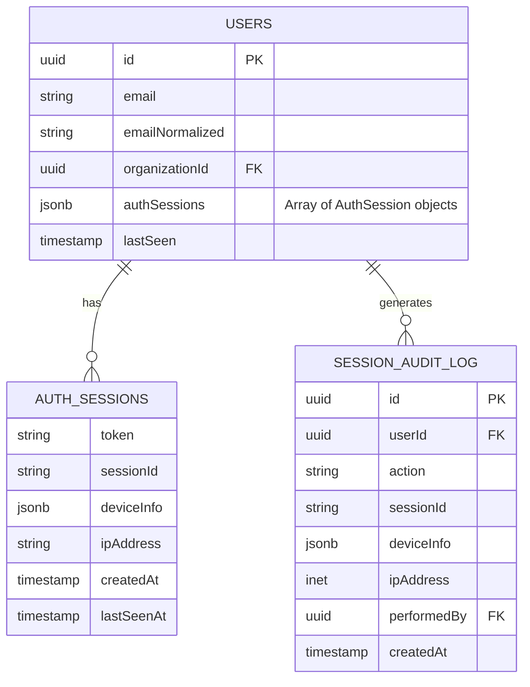

# feat: Multi-Session Authentication Support

## Overview

Users are being kicked out of sessions when logging in from a second device. This happens because the current `/sign-out` endpoint revokes ALL tokens instead of just the current session's token. The system already stores multiple tokens per user (`authTokens: string[]` array), but sign-out behavior needs to be fixed, and session management UI needs to be added.

**Critical Finding:** The system is 90% ready for multi-session support. The ONLY blocking issue is the `/sign-out` endpoint setting `authTokens = '{}'` (empty array), which revokes ALL sessions instead of just the current one.

## Problem Statement

When a user logs in from a second device (e.g., mobile after laptop), the existing session on the first device should remain active. Currently:

1. Login on Device A → Token added to `authTokens[]` ✅
2. Login on Device B → Token added to `authTokens[]` ✅
3. Logout on Device B → **ALL tokens cleared** ❌ (kicks out Device A)

**Expected Behavior:**
- Logout should only invalidate the current device's token
- Other sessions should remain active
- Users should be able to view and manage their active sessions

## Technical Context

### Current Architecture

**Tech Stack:**
- Backend: NestJS v11.1.6 with TypeScript
- Frontend: Angular v18.2.x with Akita state management
- Database: PostgreSQL with TypeORM
- Auth: JWT (RS256, 30-day expiration) with Passport.js

**Key Files:**
- `/apps/api/src/user/auth/auth.service.ts` - Token validation, cleanup, CRUD
- `/apps/api/src/user/user-auth.controller.ts:71-88` - Sign-out endpoint
- `/apps/api/src/user/user.entity.ts:146-147` - Token storage schema
- `/apps/web/src/app/state/session/session.store.ts` - Frontend state
- `/apps/web/src/app/_core/interceptors/request.interceptor.ts:36-42` - Token injection

### Current Token Flow

```
Login:
  user.authTokens.push(newToken)  ← APPENDS (correct!)

Validation:
  authTokens.indexOf(token) === -1  ← CHECKS MEMBERSHIP (correct!)

Refresh:
  ARRAY_REPLACE(oldToken, newToken)  ← PRESERVES OTHERS (correct!)

Sign-out:
  authTokens = '{}'  ← CLEARS ALL (BUG!)
```

### Database Schema (Current)

```typescript
// apps/api/src/user/user.entity.ts:146-147
@Column('text', { array: true, nullable: true })
authTokens: string[] = null;
```

## Proposed Solution

### Phase 1: Fix Sign-Out Behavior (CRITICAL)

**1.1 Modify Sign-Out to Remove Only Current Token**

```typescript
// auth.service.ts - NEW METHOD
public async removeSingleAuthToken(userId: string, token: string): Promise<UpdateResult> {
    return this.dataSource.query(`
        UPDATE users
        SET "authTokens" = array_remove("authTokens", $1)
        WHERE id = $2
    `, [token, userId]);
}
```

**File:** `apps/api/src/user/auth/auth.service.ts`

**1.2 Update Sign-Out Controller**

```typescript
// user-auth.controller.ts:74 - CHANGE FROM:
const result = await this.authService.removeAuthTokens(req.user.id);

// TO:
const token = req.headers.authorization?.split(' ')[1];
const result = await this.authService.removeSingleAuthToken(req.user.id, token);
```

**File:** `apps/api/src/user/user-auth.controller.ts:71-88`

**1.3 Add Sign-Out All Devices Endpoint**

```typescript
@Post('/sign-out-all')
@UseGuards(AuthGuard())
public async signOutAll(@Req() req: Request): Promise<ResponseEnvelope<boolean>> {
    const result = await this.authService.removeAuthTokens(req.user.id);
    return new ResponseEnvelope<boolean>(true, result.affected > 0);
}
```

**File:** `apps/api/src/user/user-auth.controller.ts`

### Phase 2: Session Management Endpoints

**2.1 List Active Sessions**

```typescript
@Get('/sessions')
@UseGuards(AuthGuard())
public async getActiveSessions(@Req() req: Request): Promise<ResponseEnvelope<Session[]>> {
    const sessions = await this.authService.getActiveSessions(req.user.id);
    const currentToken = req.headers.authorization?.split(' ')[1];

    return new ResponseEnvelope(sessions.map(s => ({
        ...s,
        isCurrent: s.token === currentToken
    })));
}
```

**2.2 Revoke Specific Session**

```typescript
@Delete('/sessions/:sessionId')
@UseGuards(AuthGuard())
public async revokeSession(
    @Req() req: Request,
    @Param('sessionId') sessionId: string
): Promise<ResponseEnvelope<boolean>> {
    const currentToken = req.headers.authorization?.split(' ')[1];

    // Prevent revoking current session
    if (sessionId === this.hashToken(currentToken)) {
        throw new BadRequestException('Cannot revoke current session. Use /sign-out instead.');
    }

    const result = await this.authService.revokeSessionById(req.user.id, sessionId);
    return new ResponseEnvelope<boolean>(true, result);
}
```

**File:** `apps/api/src/user/user-auth.controller.ts`

### Phase 3: Session Metadata Enhancement

**3.1 Schema Migration**

Migrate `authTokens` from `text[]` to `jsonb[]` to store session metadata:

```sql
-- Migration: Enhance authTokens to store metadata
ALTER TABLE users
ADD COLUMN auth_sessions jsonb[] DEFAULT '{}';

-- Migrate existing tokens
UPDATE users
SET auth_sessions = (
    SELECT array_agg(
        jsonb_build_object(
            'token', token,
            'deviceInfo', jsonb_build_object('name', 'Unknown Device'),
            'createdAt', NOW(),
            'lastSeenAt', NOW()
        )
    )
    FROM unnest(COALESCE("authTokens", '{}')) AS token
)
WHERE "authTokens" IS NOT NULL;

-- Remove old column after verification
-- ALTER TABLE users DROP COLUMN "authTokens";
-- ALTER TABLE users RENAME COLUMN auth_sessions TO "authTokens";
```

**3.2 Updated Entity**

```typescript
// user.entity.ts
interface AuthSession {
    token: string;
    sessionId: string;
    deviceInfo: {
        name: string;
        type: 'desktop' | 'mobile' | 'tablet';
        browser?: string;
        os?: string;
        ip?: string;
        location?: string;
    };
    createdAt: string;
    lastSeenAt: string;
}

@Column('jsonb', { array: true, nullable: true })
authTokens: AuthSession[] = null;
```

**File:** `apps/api/src/user/user.entity.ts`

**3.3 Device Detection Service**

```typescript
// device-detection.service.ts
import * as UAParser from 'ua-parser-js';

@Injectable()
export class DeviceDetectionService {
    parseUserAgent(userAgent: string): DeviceInfo {
        const parser = new UAParser(userAgent);
        return {
            browser: parser.getBrowser().name,
            os: parser.getOS().name,
            type: this.getDeviceType(parser.getDevice().type),
            name: `${parser.getBrowser().name} on ${parser.getOS().name}`
        };
    }
}
```

**File:** `apps/api/src/user/auth/device-detection.service.ts` (NEW)

### Phase 4: Frontend Session Management

**4.1 Session Service**

```typescript
// session.service.ts
export class SessionService {
    getActiveSessions(): Observable<Session[]> {
        return this.http.get<Session[]>(`${environment.apiUrl}/user/sessions`);
    }

    revokeSession(sessionId: string): Observable<void> {
        return this.http.delete<void>(`${environment.apiUrl}/user/sessions/${sessionId}`);
    }

    revokeAllOtherSessions(): Observable<void> {
        return this.http.post<void>(`${environment.apiUrl}/user/sign-out-all`, {});
    }
}
```

**File:** `apps/web/src/app/state/session/session.service.ts`

**4.2 Session Management Component**

```typescript
// active-sessions.component.ts
@Component({
    selector: 'app-active-sessions',
    template: `
        <h2>Active Sessions</h2>
        <div *ngFor="let session of sessions">
            <div class="session-card" [class.current]="session.isCurrent">
                <span class="device-icon">{{ getDeviceIcon(session.deviceInfo.type) }}</span>
                <div class="session-info">
                    <strong>{{ session.deviceInfo.name }}</strong>
                    <span *ngIf="session.isCurrent">(This device)</span>
                    <p>Last active: {{ session.lastSeenAt | timeAgo }}</p>
                </div>
                <button *ngIf="!session.isCurrent" (click)="revokeSession(session.sessionId)">
                    Revoke
                </button>
            </div>
        </div>
        <button (click)="revokeAllOther()">Sign out from all other devices</button>
    `
})
export class ActiveSessionsComponent {}
```

**File:** `apps/web/src/app/pages/account/active-sessions/active-sessions.component.ts` (NEW)

## Acceptance Criteria

### Functional Requirements

- [ ] User can log in from multiple devices simultaneously without being kicked out
- [ ] User can view a list of all active sessions with device info
- [ ] User can sign out from current device only
- [ ] User can sign out from all devices
- [ ] User can revoke specific sessions (except current)
- [ ] Sessions display device type, browser, and last activity time
- [ ] Current session is clearly marked in the UI

### Non-Functional Requirements

- [ ] Sign-out operation completes within 200ms
- [ ] Session list loads within 500ms
- [ ] No breaking changes to existing login flows
- [ ] Backward compatible with existing tokens in database
- [ ] All sensitive operations require authentication

### Quality Gates

- [ ] Unit tests for new auth service methods
- [ ] Integration tests for session management endpoints
- [ ] E2E test for multi-device login scenario
- [ ] Migration script tested on staging data
- [ ] Security review of token handling changes

## Implementation Phases

### Phase 1: Core Multi-Session Fix (MVP)
**Priority:** CRITICAL

1. Add `removeSingleAuthToken()` method to auth.service.ts
2. Update `/sign-out` to use single token removal
3. Add `/sign-out-all` endpoint
4. Add `/sessions` GET endpoint (basic - token list only)
5. Add `/sessions/:id` DELETE endpoint
6. Basic frontend session list page

**Files to modify:**
- `apps/api/src/user/auth/auth.service.ts`
- `apps/api/src/user/user-auth.controller.ts`
- `apps/web/src/app/state/session/session.service.ts`
- `apps/web/src/app/pages/account/` (new component)

### Phase 2: Session Metadata
**Priority:** IMPORTANT

1. Create database migration for JSONB schema
2. Update User entity with AuthSession interface
3. Add device detection service
4. Update login endpoints to capture device info
5. Update session list to return metadata
6. Enhance frontend to display device details

**Files to modify:**
- `apps/api/src/user/user.entity.ts`
- `apps/api/src/user/auth/device-detection.service.ts` (new)
- `apps/api/src/user/user-auth.controller.ts`
- Database migration file (new)

### Phase 3: Security Enhancements
**Priority:** IMPORTANT

1. Add session limits (max 10 per user)
2. Add email notifications for new sessions
3. Add admin endpoints for session management
4. Add audit logging for session events
5. Implement last activity tracking

**Files to modify:**
- `apps/api/src/user/auth/auth.service.ts`
- `apps/api/src/user/user-auth.controller.ts`
- `apps/api/src/notification/` (email templates)
- Database migration for audit table

## Security Considerations

### Token Handling
- Tokens continue to be validated against `authTokens` array membership
- Token removal uses atomic PostgreSQL `array_remove()` function
- No race conditions in concurrent logout scenarios

### Session Limits
- Recommend max 10 concurrent sessions per user
- FIFO eviction when limit exceeded
- Notify user when old sessions are auto-revoked

### Device Verification
- User-Agent parsing for device identification
- IP address logging for security auditing
- Optional email notification for new device logins

### Audit Trail
- Log all login/logout/revoke events
- Include timestamp, IP, device info, action type
- Accessible to admins with appropriate permissions

## Database Changes

### Migration Script

```sql
-- Phase 1: No schema changes (uses existing text[] array)

-- Phase 2: Add JSONB support
-- See section 3.1 above for full migration

-- Phase 3: Add audit table
CREATE TABLE session_audit_log (
    id UUID PRIMARY KEY DEFAULT gen_random_uuid(),
    user_id UUID REFERENCES users(id),
    action VARCHAR(50) NOT NULL, -- login, logout, revoke, admin_revoke
    session_id VARCHAR(255),
    device_info JSONB,
    ip_address INET,
    performed_by UUID REFERENCES users(id), -- for admin actions
    created_at TIMESTAMP DEFAULT NOW()
);

CREATE INDEX idx_session_audit_user ON session_audit_log(user_id);
CREATE INDEX idx_session_audit_time ON session_audit_log(created_at);
```

## ERD Diagram



## Open Questions

1. **Session Limits:** Should we enforce a maximum number of concurrent sessions (recommended: 10)?
2. **Notifications:** Should users receive email alerts for new device logins?
3. **Admin Access:** Should admins be able to view/revoke user sessions?
4. **OAuth Handling:** When Okta tokens expire, should sessions auto-invalidate or attempt refresh?
5. **Inactivity Timeout:** Should sessions expire after extended inactivity (e.g., 30 days with no activity)?

## References

### Internal References
- Token storage schema: `apps/api/src/user/user.entity.ts:146-147`
- Token validation logic: `apps/api/src/user/auth/auth.service.ts:39-58`
- Sign-out endpoint: `apps/api/src/user/user-auth.controller.ts:71-88`
- JWT configuration: `apps/api/src/common.module.ts:55-62`
- Frontend session store: `apps/web/src/app/state/session/session.store.ts`

### External References
- [OWASP Session Management Cheat Sheet](https://cheatsheetseries.owasp.org/cheatsheets/Session_Management_Cheat_Sheet.html)
- [NestJS Authentication Documentation](https://docs.nestjs.com/security/authentication)
- [JWT Best Practices 2025](https://jwt.app/blog/jwt-best-practices/)
- [Auth0 Refresh Token Guide](https://auth0.com/blog/refresh-tokens-what-are-they-and-when-to-use-them/)

### Related Work
- Current auth implementation follows NestJS Passport JWT patterns
- Existing multi-tenant architecture with organization-based isolation
- Support for Basic Auth, Okta OAuth, SAML 2.0, and WPP Open strategies

---

**Generated by:** Claude Code
**Date:** 2025-12-02
